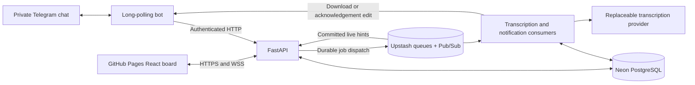

# Omni Task

A private Telegram-linked task manager with long-polling text and voice capture, task navigation, status controls, confirmed deletion, and private dashboard login links. Task rules and persistence live in the HTTP API. The private dashboard provides a three-column Kanban board, task creation and full details, drag/status controls, confirmed deletion, and light/dark themes. Owner-scoped WebSockets synchronize changes from Telegram, workers, and other dashboard tabs; PostgreSQL snapshots recover missed updates.

The assessment requirements and additional product choices are separated in [SPEC.md](SPEC.md). Stage evidence and limitations are in [TASKS.md](TASKS.md).

Submission reading order: [requirements and test checklist](docs/REQUIREMENTS.md), [plain-English interview walkthrough](docs/ARCHITECTURE_WALKTHROUGH.md), and [three-minute demonstration](docs/DEMO.md). Operations: [managed-hosting setup](docs/HOSTING_PLAN.md), the retained [Ubuntu VPS runbook](docs/DEPLOYMENT.md), and [backup/restore procedure](docs/BACKUP_RESTORE.md).

The complete source is in one public repository: [Neytrib/omni-task](https://github.com/Neytrib/omni-task). Managed hosting uses Railway API/bot/worker, GitHub Pages frontend, Neon PostgreSQL and Upstash Redis. **Pages and the API are live; full acceptance remains incomplete.** The owner supplied the private Telegram/OpenAI credentials and enabled cloud transcription; the updated bot and worker deployments succeeded. Real hosted Telegram/voice acceptance remains manual. API/worker source-connect deployments and a real Upstash/separate-worker job passed; native GitHub autodeploy is configured, with a future matching-push deployment still to be observed. Local Compose is preserved, with its bot and worker currently stopped to avoid duplicate processing.

## Managed hosting

Create protected variable files, then fill the private copies:

```sh
python3 scripts/configure_hosting.py
```

The files are `private/railway/api.env`, `bot.env` and `worker.env`. The helper generates matching service credentials, preserves existing files, never reads local `.env`, and keeps all three ignored and mode 0600. Copy them to each Railway service's protected Variables editor. PostgreSQL/Redis credentials go only to API/worker, the Telegram token only to bot, and the OpenAI key only to worker. Paid transcription is off in these new templates; existing local settings are unchanged.

The [hosting runbook](docs/HOSTING_PLAN.md) gives the exact setup, controlled migration, update and rollback steps. The owner-approved Railway Hobby project has successful API/worker source-connect deployments. The owner subsequently supplied the Telegram/OpenAI credentials privately and explicitly set `ALLOW_PAID_TRANSCRIPTION=true`; the updated worker and serialized bot activation deployments succeeded. [Bot activation run 36743007749](https://github.com/Neytrib/omni-task/actions/runs/36743007749) completed successfully. This configuration permits the owner's voice tests; no independent paid transcription test was performed. Neon direct TLS and migration `0003_live_outbox` passed, as did Upstash native TLS/PubSub/transaction/Lua probes and a harmless job consumed by the separate Railway worker. Both worker consumers were inspected and the synthetic result was removed. The [Pages dashboard](https://neytrib.github.io/omni-task/) and its compiled assets return HTTP 200, and [API readiness](https://api-production-08eb2.up.railway.app/api/health/ready) returns `status: ready`. [Pages run 36736415868](https://github.com/Neytrib/omni-task/actions/runs/36736415868) completed successfully for `a44d74d`. Synthetic Arc login, live status synchronization and logout passed; the complete hosted Telegram/text/voice flow still needs the owner's acceptance test.

| Deployment path | Configuration |
| --- | --- |
| Railway API and worker | GitHub `main` sources in [.railway/railway.ts](.railway/railway.ts); native triggers configured and source-connect deployments verified |
| Railway bot | [Serialized stop-before-start workflow](.github/workflows/railway-bot.yml); no competing native bot autodeploy |
| GitHub Pages | [.github/workflows/pages.yml](.github/workflows/pages.yml), compiled `frontend/dist` only |
| Pages public variables | `PUBLIC_API_ORIGIN` = Railway HTTPS origin; optional `PUBLIC_WS_ORIGIN` = WSS on the same API hostname |

Pages uses `npm ci`, tests, type checking and `npm run build` inside `frontend/`, with `/omni-task/` as its production base. No API/provider secret belongs in any `VITE_*` or public repository variable. Without `PUBLIC_API_ORIGIN`, checks run but deployment is skipped with an explanatory summary. Bot deployment has its protected environment-scoped GitHub Actions secret configured and serializes replacement to prevent two pollers sharing a token. API/worker native GitHub triggers are configured after account linking and explicit source connection. They do not wait for GitHub checks; run applicable tests before pushing and verify that each relevant future push produces the expected deployment. The runbook retains the setup commands for reproducibility. The latest docs-only `a44d74d` push produced `SKIPPED` API/worker deployments, as expected from their source watch patterns; a source-matching pushed build is still unverified. The local bot and worker were stopped with no pending voice/notification work before the private credentials were activated on Railway. Local credentials and database data are preserved and were not migrated. Keep the local bot stopped while Railway uses that token; use a separate development token before restarting it. The hosted services run independently of the local computer.

Browser sessions use secure partitioned HttpOnly cookies across Pages and Railway, with exact CORS/Origin checks and CSRF protection. Live Arc verification passed login/token removal, clean-URL reload, WebSocket status updates, a browser status mutation and logout using a disposable account. Unsupported or blocked cookies produce an explicit login failure. No second repository, Cloudflare Pages or browser-stored permanent credential is used.

## Local setup

Requirements: Docker Engine with Docker Compose 2.24.4+ and Python 3.10+ for the helper scripts. Host Python application dependencies, Node, and uv are optional: Docker builds the complete stack. Local frontend development uses Node 22.12+ (the image pins Node 24); local backend development uses Python 3.12 and uv. Exact resolved packages are in `uv.lock` and `frontend/package-lock.json`; container base images are pinned by digest.

From a clean checkout (no existing database is required):

```sh
git clone https://github.com/Neytrib/omni-task.git
cd omni-task
python3 scripts/configure_env.py
docker compose config --quiet
docker compose up --build -d --wait
docker compose ps
curl --fail http://127.0.0.1:8080/api/health/ready
```

Alternatively, extract the supplied source-only archive into an empty directory, enter `omni-task`, verify its manifest with `sha256sum -c MANIFEST.sha256` (Ubuntu/Linux) or `shasum -a 256 -c MANIFEST.sha256` (macOS), then run the commands above from `python3 scripts/configure_env.py` onward. The manifest belongs to the archive; the older S9 archive predates later source changes.

`configure_env.py` creates an ignored `.env` with random PostgreSQL and bot-service credentials and mode 0600. It preserves an existing file. Do not commit it or copy secrets into `.env.example`. No Telegram or OpenAI token, provider call, public tunnel, or deployment is needed for local API tests. Without `TELEGRAM_BOT_TOKEN`, the bot reports polling as disabled; set a real token as described below to use Telegram.

Expect six healthy long-running services and a successfully exited `migrate` initializer. Open [http://127.0.0.1:8080](http://127.0.0.1:8080) in **Arc** to open the dashboard. Signed-out visitors get Telegram access instructions. A fresh `/profile` link exchanges its fragment by POST, clears the URL, and opens the private board. Keep the configured `DASHBOARD_ORIGIN` exact: `localhost` and `127.0.0.1` are different browser origins.

To stop while preserving data:

```sh
docker compose down
```

Start again with `docker compose up -d --wait`. PostgreSQL and Redis named volumes remain. **Do not add `--volumes`/`-v` to routine shutdown:** that explicitly deletes stored data. No reset is performed automatically.

## Local service boundaries and migrations

| Service | Purpose | Network access |
| --- | --- | --- |
| frontend | Vite-built React dashboard, nginx same-origin `/api/` proxy | Host loopback `127.0.0.1:8080`; API |
| api | FastAPI task/authentication boundary | Service network and private data network |
| bot | aiogram long polling, direct interaction replies, authenticated API client | Service network only; no DB/Redis credentials or client packages |
| worker | Supervised Celery consumers for transcription and independent notifications; harmless queue probe | Redis, PostgreSQL, service network |
| postgres | Authoritative persistent application state | Private internal network, no published port |
| redis | Celery broker/results and distinct Pub/Sub live hints | Private internal network, no published port |
| migrate | One-shot `alembic upgrade head` | Runs after PostgreSQL readiness; gates API/worker startup |

API and worker reuse one Python image. The bot shares the Python base and HTTP dependency stack but installs a separate dependency group and copies bot source plus the dependency-free structured logging helper. nginx never forwards `/internal/`; API and bot ports are not published. Redis uses AOF with `appendfsync everysec` and `noeviction`; Redis transport is not the source of task or authentication truth.

Migrations are deliberate operations, not executed in every API process. Inspect or apply them:

```sh
docker compose run --rm migrate alembic current
docker compose run --rm migrate alembic check
docker compose run --rm migrate
```

For a schema-changing update, stop API/worker first, back up important data, rebuild, and apply the migration before restarting. The initializer must exit successfully; do not bypass migration failures. This local setup is not a public production deployment. A production deployment requires TLS, the exact HTTPS `DASHBOARD_ORIGIN`, `APP_ENV=production`, and `COOKIE_SECURE=true`.

## Verification

A Redis/Celery proof sends a synthetic UUID from the API container and verifies that a separate worker container executed it:

```sh
docker compose exec -T api python scripts/queue_smoke.py
```

Expected output contains `"status": "passed"`, `"transport": "redis"`, and the worker hostname/process. It neither creates a task nor calls an external provider. The short-lived result is removed after inspection.

Check configured and actual network/dependency boundaries:

```sh
python3 scripts/check_infrastructure.py --runtime
```

This checks that only the frontend is published to loopback; PostgreSQL/Redis have no runtime host port bindings; the data network is internal; bot has neither data-network membership nor PostgreSQL/Redis environment variables and installed clients.

Run the backend tests against a dedicated temporary PostgreSQL database:

```sh
python3 scripts/test_backend.py
```

The helper builds the test image, creates a random database whose name includes `test`, runs pytest through the private Docker network, and drops only that database in a `finally` block. It never truncates the application database. Tests use synthetic users/content and no real Telegram or transcription transport. If the helper process is forcibly killed, its temporary test database may remain; inspect databases before manually removing any leftover. An interrupted test run is not a successful result.

Verify container recreation without interrupting your application or modifying its data:

```sh
docker compose build api bot frontend
python3 scripts/check_isolated_recovery.py
```

This starts the current images in a fresh private Compose project with random credentials, a fake provider, blank Telegram/OpenAI keys, its own volumes/networks, and no published ports. It recreates that project's PostgreSQL/Redis containers and checks complete task content, session continuity, deduplication, user isolation, a Redis AOF marker, and both worker consumers. Cleanup removes only the temporary project's resources. The older `scripts/persistence_smoke.py` intentionally interrupts the active project's data containers and leaves minimal synthetic receipts; prefer the isolated check above.

Optional local static and frontend checks:

```sh
uv sync --locked --group bot
uv run ruff check omni_logging.py backend bot scripts tests deploy
npm --prefix frontend ci
npm --prefix frontend run test
npm --prefix frontend run typecheck
npm --prefix frontend run build
```

The frontend build includes TypeScript checking and needs no downloaded browser. Browser inspection must use Arc. Do not install or invoke Chrome/Chromium or a bundled headless browser.

## Configuration reference

The local placeholder template is [.env.example](.env.example). The VPS template is [production.env.example](production.env.example); use `scripts/configure_production.py` as shown in the VPS runbook. Managed hosting uses the separate [Railway templates](deploy/railway) and `scripts/configure_hosting.py`. Leave real credentials out of every public example, archive and image.

| Variable | Local default / placeholder | Production behavior |
| --- | --- | --- |
| `POSTGRES_USER`, `POSTGRES_DB` | `omni_task` | Stable identifiers; changing the password env does not rotate an existing PostgreSQL role. |
| `POSTGRES_PASSWORD` | Random URL-safe secret generated locally | Independent generated secret in root-only env file; protect backups separately. |
| `BOT_API_KEY` | Random server-only secret | At least 32 characters; shared by API/bot/worker, never browser code. |
| `BOT_IDENTITY` | `omni-task-local` | Set a stable namespace for the chosen bot; do not change during token rotation. |
| `TELEGRAM_BOT_TOKEN` | Blank: polling disabled | Enter privately; only one polling process per token. |
| `APP_ENV`, `COOKIE_SECURE` | `development`, `false` for loopback HTTP | Production uses `production`, `true`. |
| `DASHBOARD_ORIGIN` | `http://127.0.0.1:8080` | Pages: `https://neytrib.github.io`; VPS: exact `https://DOMAIN`. |
| `DASHBOARD_URL` | Unset: existing origin plus `/login` | Pages: `https://neytrib.github.io/omni-task/`; separate from the browser origin. |
| `COOKIE_NAME`, `COOKIE_SAMESITE`, `COOKIE_PARTITIONED` | `omni_session`, `lax`, `false` | Pages: `__Host-omni_session`, `none`, `true`, together with Secure. |
| `SESSION_TTL_SECONDS`, `LOGIN_TTL_SECONDS` | `604800`, `300` | Absolute session and single-use login-link lifetimes. |
| `LIVE_CHANNEL` | `omni-task:live:v1` | Unique per deployment; Pub/Sub spans Redis DB numbers. |
| `TRANSCRIPTION_PROVIDER` | `disabled` | `disabled`, explicitly labeled `fake`, or deliberately enabled `openai`. |
| `TRANSCRIPTION_MODEL` | `whisper-1` | Configurable; recheck provider support before changing it. |
| `OPENAI_API_KEY`, `ALLOW_PAID_TRANSCRIPTION` | Blank, `false` | Worker-only key and explicit paid-call gate. |
| `VOICE_MAX_DURATION_SECONDS`, `VOICE_MAX_BYTES` | `600`, `19000000` | Intake and decoded-media bounds; lower if needed. |
| `VOICE_USER_DAILY_LIMIT`, `VOICE_GLOBAL_DAILY_LIMIT` | `10`, `50` | API-only accepted recordings per rolling 24 hours, per user and across the database. Positive values only. |
| `VOICE_USER_PENDING_LIMIT`, `VOICE_GLOBAL_PENDING_LIMIT` | `2`, `10` | API-only queued/processing recordings of any age, per user and across the database. |
| `VOICE_DOWNLOAD_TIMEOUT_SECONDS`, `VOICE_CONVERSION_TIMEOUT_SECONDS`, `VOICE_PROVIDER_TIMEOUT_SECONDS` | `30`, `30`, `90` | Bounded external/media operations. |
| `COMPOSE_PROJECT_NAME`, `RELEASE_TAG` | Local project `omni-task`, image tag `local` | Production project `omni-task-prod`; unique immutable tag per release. |
| `DOMAIN`, `ACME_EMAIL` | Not used locally | Public hostname and certificate-contact email; no scheme/path in DOMAIN. |

Compose supplies internal `DATABASE_URL`, `REDIS_URL`, `BOT_BASE_URL`, and bot `API_BASE_URL`. Managed hosting instead uses Neon direct PostgreSQL with TLS, native Upstash `rediss://` with certificate/hostname verification, and Railway private service references; see the hosting runbook. Never copy these into frontend configuration. Local and server credentials are independent. Protected variables remain accessible to authorized hosting administrators; no separate secrets vault is claimed.

## Architecture and message flows

The bot, API, worker, frontend, PostgreSQL, and Redis are separate services. API and worker share persistence/business logic; the bot uses authenticated HTTP only. Managed hosting serves the static frontend from Pages and HTTPS/WSS from Railway. The retained Compose/VPS deployment instead uses an nginx frontend proxy and optional HTTPS edge on one origin.



**Text:** Telegram message -> authenticated API -> one task plus unique source receipt and live intent in PostgreSQL -> Redis hint -> owner's API WebSocket -> authoritative dashboard snapshot. Repeated delivery returns the existing result; identical text in two separate messages creates two tasks.

**Voice:** immediate Telegram receipt -> committed processing request -> durable dispatcher publishes its UUID -> worker downloads, validates and converts audio -> provider returns a complete transcript -> cached result and one Pending task. Processing state is separate from task status; failed/empty transcription creates no task.

**Notification:** task creation commits a separate notification record -> its own Redis queue/consumer -> authenticated bot adapter edits the original acknowledgement with current buttons. Notification retries never repeat successful transcription. The database retains accepted work when Redis is unavailable, and bounded leases recover interrupted jobs. Duplicate/stale live hints trigger revision-aware snapshots, including after reconnect. See the interview walkthrough for the concrete tradeoffs and guarantees.

## Authentication and API behavior

Internal `/internal/bot/*` calls require `Authorization: Bearer <BOT_API_KEY>`. The API authenticates that service credential before resolving Telegram identity. Browser sessions cannot authorize internal operations, and the browser proxy strips service authorization headers. Telegram users are resolved from verified bot requests; a browser cannot select its task owner.

Login links contain a random token in the URL fragment. Only `POST /api/auth/exchange` consumes it; a GET is harmless. Exchange requires the exact configured `Origin` and returns an opaque HttpOnly, host-only cookie. Same-origin Compose/VPS uses SameSite=Lax; Pages/Railway uses Secure, SameSite=None, Partitioned cookies and credentialed CORS. Only token/session hashes are stored in PostgreSQL. Session reads return a CSRF token, which authenticated mutations send in `X-CSRF-Token` together with the exact Origin. Logout revokes the current session; expired and revoked sessions fail authentication. The page removes the fragment before a single exchange POST, including under React StrictMode, then verifies the browser session through a GET. There is no registration form, manually entered login code or permanent browser localStorage credential. The hosted flow was verified in Arc with a disposable synthetic account; other browsers and privacy configurations remain unverified.

Tasks accept complete text up to the explicit 50,000-code-point limit. Whitespace-only and oversized inputs fail validation; accepted text, whitespace, Unicode, and line breaks are preserved exactly. Titles are deterministic display strings, at most 80 code points. Status values are `pending`, `in_progress`, and `completed`. Source receipts enforce duplicate delivery in PostgreSQL and survive task deletion without its content. Processing requests have their own state, separate from task status. Failed transcription never creates a task.

All ownership checks run on the server. Browser IDs, query parameters, or guessed task UUIDs cannot transfer ownership. Errors omit submitted content and authentication credentials. Access logging is disabled for the API, bot, and frontend proxy to avoid recording bearer material supplied in URLs; avoid enabling request/body/header logging when extending the services.

### API reference and manual walkthrough

| Operation | Browser route | Bot route |
| --- | --- | --- |
| Resolve Telegram user | Unavailable | `POST /internal/bot/users` with `telegram_user_id`, `private_chat_id` |
| List tasks | `GET /api/tasks?limit=20` | `GET /internal/bot/tasks?telegram_user_id=…&limit=20` |
| Retrieve task | `GET /api/tasks/{id}` | `GET /internal/bot/tasks/{id}?telegram_user_id=…` |
| Create task | `POST /api/tasks`, `{content}`, UUID `Idempotency-Key` | `POST /internal/bot/tasks`, `{telegram_user_id, message_id, content}` |
| Change status | `PATCH /api/tasks/{id}`, `{status}`, `If-Match` version | Same under `/internal/bot`, Telegram actor in query |
| Delete task | `DELETE /api/tasks/{id}`, `If-Match` version | Same under `/internal/bot`, Telegram actor in query |
| Record processing request | Unavailable | `POST /internal/bot/processing-requests`, `{telegram_user_id, message_id, file_id, duration_seconds, file_size, acknowledgement_message_id}` |
| Retrieve processing state | Unavailable | `GET /internal/bot/processing-requests/{id}?telegram_user_id=…` |
| Issue login link | Unavailable | `POST /internal/bot/login-links`, `{telegram_user_id}` |
| Exchange login | `POST /api/auth/exchange`, `{token}` | Unavailable |
| Current session | `GET /api/session` | Unavailable |
| Logout | `POST /api/auth/logout` | Unavailable |

Lists return `{items, next_cursor, revision}`. Pass `next_cursor` as the next request's `cursor`; it is owner-bound and must not be edited. Page size is 1–100. Tasks include their current `version`; send that positive integer as `If-Match` for status changes and deletion. A stale version returns 409. Invalid fields return 422. Missing or unowned tasks return 404. The full API test suite includes login expiry and concurrency cases that require controlled database fixtures.

After starting the stack, run this small live HTTP walkthrough:

```sh
docker compose exec -T api python scripts/api_smoke.py
```

It creates two synthetic development users, preserves multiline Unicode content, repeats a source message, logs both users in, verifies each list and cross-user denial, rejects an invalid status/forged owner, changes status, deletes the tasks, rejects resurrection, and logs out. Credentials, login links, and task contents are never printed. Expected output ends with `"status": "passed"`. This command writes to the local development database; successful completion deletes its tasks but retains synthetic users and minimal source/session receipts. An interrupted or failed walkthrough can leave its synthetic tasks for inspection. For disposable verification use `scripts/test_backend.py` instead.

Manual review order:

1. Start with the setup commands and check six healthy services plus the exited migration initializer.
2. On macOS, run `python3 scripts/open_dev_login.py` to open a short-lived synthetic login directly in Arc. It prints and saves no credentials and refuses non-local/non-development configuration or alternative browsers. Confirm that the fragment disappears, the private board opens, and Log out returns to the private-link prompt. The synthetic user remains in PostgreSQL; its task board is separate from your Telegram account.
3. Run the queue probe, infrastructure verification, live API walkthrough, and backend tests above; inspect each real exit code.
4. Run `python3 scripts/check_isolated_recovery.py` to exercise container recreation in an isolated project. It leaves your running application and its data intact.
5. Stop with `docker compose down`, without a volume-deletion option.

## Telegram setup and manual walkthrough

1. Put your real BotFather token in the ignored `.env` as `TELEGRAM_BOT_TOKEN=...`. It is different from the generated `BOT_API_KEY`, which authenticates bot-to-API requests. Keep `.env` private (mode 0600); never paste tokens into commands, source, test fixtures, or logs. Leave the token empty for local fake-transport tests.
2. Set `BOT_IDENTITY` to a namespace unique to that Telegram bot, such as its numeric bot ID. Keep it unchanged when rotating the same bot's token; choose a different value before changing to a different bot. This namespace is part of durable source deduplication.
3. Run `docker compose up -d --build --wait`. Run only one polling instance for the token. Stop any other application using that token, and remove a pre-existing webhook through your bot administration setup before using polling; this application does not silently remove webhooks or discard pending updates. No tunnel or public bot port is required.
4. In the bot's **private chat**, send `/start`, then `/help`. Expect the short welcome on `/start`; `/help` explains text/voice capture, all commands, navigation, statuses, confirmed deletion and privacy. `/profile` is the only dashboard-link command. Group/channel/edited messages are ignored.
5. Send `Prepare the internship demo` followed by a new line and `Check the task status buttons.` as one message. Expect one **Task saved** confirmation with Pending / In Progress / Completed buttons and a red **Delete task** button. Deletion still asks for confirmation; **Cancel** keeps the task. Open tasks through `/list`. The full text, including line breaks, is stored unchanged. Sending the same words as a second message intentionally creates another task.
6. Send `/list`, tap the new task, and inspect its title, content, current status, and UTC creation time. Tap **In Progress**, then select it again: both display the current state without an error. Tap **Completed**, then **Back to tasks**. Navigation should edit the bot message. Seed at least 12 tasks to check five-item pages, Next, Previous, and Back to the previous page. If the list changed, pagination resets with an explanation.
7. Open the task, tap **Delete**, then **Cancel**: the task remains. Tap **Delete** again and **Confirm delete**: it disappears from the list. Old, invalid, expired, or cross-user controls cannot delete another task. Run `/list` for fresh controls after a bot restart or 15 minutes.
8. Send `/profile`. Tap **Open Dashboard** in Telegram Desktop on this machine and open the link in **Arc**. The single-use link clears from the URL and opens your private task board. A fresh `/profile` request replaces previous unused links; logging out revokes the current session.
9. Try an unknown command, a photo/caption, and whitespace-only input. Expect clear explanations without accidental task creation. For voice recording, follow the separate walkthrough below; its configured limits default to `VOICE_MAX_DURATION_SECONDS=600` and `VOICE_MAX_BYTES=19000000`, and can be lowered.

The local dashboard origin is `http://127.0.0.1:8080`. Use this dotted loopback address because Telegram rejects `localhost` in URL buttons. That link works on the computer running Docker; a phone's loopback address refers to the phone. Remote dashboard access requires a separately authorized hosting/TLS setup. Do not expose PostgreSQL/Redis or create an automatic public tunnel to work around this.

For long content, the bot displays a bounded preview with **Read full text** pagination and dashboard access. Every accepted character remains available through the full-text pages; the dashboard detail dialog also shows the complete content. Replies use plain text and disable URL previews; callbacks contain no credentials or task bodies.

Polling confirms an incoming update only after its handler's durable API outcome. A transient API failure retries the same source without asking the user to resend. An outage can temporarily delay other updates because polling is deliberately sequential; Telegram retains pending updates for at most 24 hours. A crash or ambiguous network response can repeat a Telegram confirmation, but the database will not repeat the task. Telegram delivery is not exactly-once. Blocking the bot or permanent output rejection does not undo a saved task or stall the inbox indefinitely.

Run focused bot tests against an isolated disposable PostgreSQL database (fake Telegram transport, no external sends):

```sh
python3 scripts/test_backend.py -q tests/test_bot.py tests/test_bot_runtime.py
```

Run `python3 scripts/test_backend.py` for the combined regression suite. The bot test image includes aiogram; the production bot image still excludes database/Redis libraries and credentials. `python3 scripts/check_infrastructure.py --runtime` verifies those boundaries.

## Voice configuration and manual check

The default `TRANSCRIPTION_PROVIDER=disabled` makes no paid calls. A submitted recording receives a receipt, then an honest configuration failure; no task is fabricated. Choose one explicit provider in the private `.env`:

- **Free demonstration:** `TRANSCRIPTION_PROVIDER=fake`. Telegram audio is really downloaded, validated, and converted, but the task contains clearly labeled sample text instead of recognized speech. This is a transport/recovery test, not a speech-recognition test.
- **Real speech recognition, only after paid-call approval:** `TRANSCRIPTION_PROVIDER=openai`, `OPENAI_API_KEY=...`, and `ALLOW_PAID_TRANSCRIPTION=true`. `TRANSCRIPTION_MODEL=whisper-1` remains configurable. Keep the key in `.env`; only the worker receives it. Do not paste it into chat or commit it. Turn the paid flag off when the approved test ends.

The API key may belong to a different OpenAI account from the one used for ChatGPT/Codex. Use a project API key with transcription/model access; no ChatGPT account ID or Telegram credential is coupled to it. An invalid/revoked key fails that voice job without affecting text tasks or sessions. [OpenAI project keys](https://help.openai.com/en/articles/9186755-managing-projects-in-the-api-platform) and [separate API billing](https://help.openai.com/en/articles/9039756-managing-billing-for-chatgpt-and-the-api-platform).

Voice admission is bounded in PostgreSQL: defaults allow 10 new recordings per user and 50 globally in a rolling 24 hours, with at most 2 queued/processing recordings per user and 10 globally. Limits apply to all providers and survive API restarts. Rejected recordings create no job; the bot resolves the receipt and continues handling messages. Duplicate delivery reuses the accepted outcome, and accepted jobs continue recovering when new intake is full. Completed, failed and deleted recordings retain their daily count until the window expires. Text tasks remain available. Configure the four positive `VOICE_*_LIMIT` values on the API (or in the Compose environment file); workers and bot do not need them.

These are admission/backlog limits, not an exact currency or daily provider-billing cap: earlier accepted work can execute later, and provider retries/ambiguous responses can incur additional charges within the existing attempt cap. Do not remove processing/source records to reset usage. Migration `0004_voice_admission_index` adds the time-window index. Release order is quota-aware bot first, controlled index migration, then the API; a bot-only push is excluded by the API/worker watch rules. See [TASKS.md](TASKS.md) for the authorized release status. Existing paid-provider settings are preserved.

Apply provider changes to both intake and execution with `docker compose up -d --wait api worker`. The provider choice is captured with each recording; switching configuration does not turn a queued demo into a paid request. Re-send as a new voice message if you deliberately want a new attempt after a permanent failure. The OpenAI adapter uses the multipart transcription endpoint through the existing HTTP client and can be replaced without changing task handlers.

The worker converts Telegram OGG/Opus (also recognized MP3/M4A voice containers) to mono 16 kHz WAV. Both intake and worker enforce limits; full decoding rejects excess duration/output rather than cutting it. Downloads/conversion have 30-second limits, the provider has a 90-second limit, and all temporary files are removed on completion/failure. A startup/periodic sweep removes abandoned, unlocked audio directories older than one hour. Transcripts over 50,000 characters, empty responses, and invalid audio fail explicitly.

OpenAI currently documents WAV support and 25 MB uploads; this app caps input at 19 MB and normalized WAV below 20 MB. `whisper-1` is scheduled for retirement on February 26, 2027; verify and configure an appropriate supported replacement before then. See the [transcription guide](https://developers.openai.com/api/docs/guides/speech-to-text) and [deprecation schedule](https://developers.openai.com/api/docs/deprecations).

Pause/resume walkthrough, with no paid calls in demo mode:

1. Set `TRANSCRIPTION_PROVIDER=fake` and `ALLOW_PAID_TRANSCRIPTION=false` in `.env`, then run `docker compose up -d --wait api worker`.
2. Run `docker compose pause worker`.
3. In the private Telegram chat, send a short voice recording. Expect **Voice received. Queuing transcription…** promptly. Send `/help` and `/list`; both should respond while the worker is paused.
4. Run `docker compose unpause worker`. Within normal local processing time, the original receipt should change to a demo task result with status buttons. There should be exactly one new Pending task in `/list`.
5. Open it, use **Read full text** if needed, change its status, and verify that re-selecting that status is harmless. Delete only this demo task with confirmation if you no longer need it.
6. Always unpause the worker before leaving. For real speech recognition, repeat with an approved provider configuration and confirm the entire spoken content against the task; demo text is not transcription evidence.

Database-backed dispatch scans resume accepted work after broker/worker outages. Transcription and notification retries are independent (3 and 5 attempts with bounded exponential backoff/jitter). Successful transcripts are committed before task creation can be retried; task creation and the notification intent commit together. Known acknowledgement messages are edited, including a successful no-op for Telegram “not modified.” An ambiguous external send/provider timeout can still mean an already-completed external operation; only durable task creation is guaranteed once per original source.

Run the complete deterministic suite with `python3 scripts/test_backend.py -q`. Its voice integration test uses real Redis with isolated key prefixes, a separate Celery process, actual synthetic OGG/Opus conversion, a stopped/resumed worker, duplicate UUID-only jobs, and a transient notification failure. It never calls OpenAI or sends real Telegram messages. PostgreSQL is a disposable test database; Redis production queues are untouched.

## Dashboard walkthrough (S6–S7)

The running local dashboard uses the real session/task API and has no built-in sample tasks. The original paper/charcoal visual design, responsive rules, and accessibility decisions are in [DESIGN.md](DESIGN.md). Fonts are bundled locally with their licenses; no remote font request carries a login URL.

1. On this Mac, send `/profile` in Telegram and open **Open Dashboard** in Arc. Confirm the token disappears from the URL. A used or expired link asks for a fresh `/profile` link.
2. Select **New task**, enter multiline text, and select **Create task** once. It appears in Pending. Open its title to inspect the complete unchanged content, source, and timestamps.
3. Drag the card from its title, preview, or background to **In Progress**. The six-dot handle also remains available. On touch, hold briefly before dragging; quick swipes remain scrolling. Alternatively Tab to its labeled status selector and select **Completed**. Refresh and verify the persisted status. Task ordering is newest first, not custom sorting.
4. Open details and choose **Delete task**. **Cancel** keeps it. Repeat and confirm only a disposable test task; the card disappears. Escape closes dialogs and restores focus.
5. Toggle the theme, reload, and verify the preference remains. Test Arc responsive mode at 390×844 and 1440×900 plus 200% zoom. The phone layout stacks the columns; long content stays within the detail dialog.
6. In Arc DevTools, temporarily choose Network → Offline. Expect an Offline indicator and disabled writes with cached tasks preserved. Return to No throttling; reconnect/refresh should restore current tasks. A failed status request rolls back and shows an error.
7. Send a text task in Telegram. Its card appears automatically while the indicator is **Live**. Keep two tabs open to see status changes and deletion synchronize. **Log out** removes private content; a reload remains signed out.

Uncertain create responses keep the exact draft and request identity. **Retry save** safely retries it; closing and reopening preserves it. Check the board before using **Discard draft** and starting a new request. Drafts are memory-only and disappear on logout/session expiry/reload.

To rebuild only the dashboard without restarting the API or worker:

```sh
docker compose build frontend
docker compose up -d --no-deps --wait frontend
```

S6 Arc navigation was blocked at the time. S7 verified the desktop dark board, live changes, two tabs, offline recovery and logout. S8 inspected safe multiline rendering, creation/details, keyboard status selection, deletion cancellation/confirmation, notice dismissal and recovery to Live after an API restart. Its one audit-created task was removed; pre-existing tasks were preserved. Phone/light-theme/zoom/whole-card pointer-drag visual checks remain unverified because native Arc controls intermittently timed out or had no observed effect; DOM tests do not substitute for those checks.

## Live synchronization and recovery (S7)

All task commits, including voice worker completion, record a durable PostgreSQL revision/outbox hint. An API dispatcher publishes committed hints to Redis Pub/Sub; every API process subscribes independently and forwards only owner-scoped hints to authenticated browser sockets. Celery's transcription and notification queues remain separate. The dashboard reloads a consistent complete snapshot instead of trusting event order or missed Redis history.

WebSockets use the same HttpOnly session cookie and exact configured Origin. Logout/expiry closes existing connections at the next authorization check (normally within 15 seconds). PostgreSQL revision heartbeats also repair a lost final hint; a Redis subscriber reconnection requests a resync. The browser reconnects with jitter capped at 30 seconds and reloads state. Cached boards remain available during interruptions with a Reconnecting/Offline indicator. Live is shown only after the current snapshot catches up.

`LIVE_CHANNEL` is configurable in `.env.example` (default `omni-task:live:v1`); separate deployments/tests sharing Redis need different channels even if they use different Redis database numbers. Only the frontend loopback port is published. Production must use HTTPS, secure cookies, and an exact `DASHBOARD_ORIGIN` matching the browser.

Manual Arc check:

1. Open a fresh `/profile` link, then open a second tab at the same dashboard origin. Both should reach **Live**.
2. Send a disposable text task in Telegram. Both boards should show one Pending card without refresh. Use its Telegram status button; both cards should move. Dashboard changes appear the next time you list/open that task in Telegram; old bot messages do not automatically refresh.
3. Create a disposable task in one dashboard tab, open its details in the other, and delete it with confirmation in the first. The other card disappears and its open dialog closes.
4. Put one Arc tab offline, perform create/status/delete operations from the other interface, then restore the tab's network. Its whole board must converge, including deletions.
5. For an optional local interruption check, `docker compose stop redis`, change tasks through the dashboard/API, then `docker compose start redis`. Expect reconnecting while Redis is down and Live after resync; never delete volumes. `docker compose restart api` exercises socket reconnect. Session expiry/logout must clear private content in every tab.
6. A second Telegram user's separately authenticated browser session must never receive the first user's tasks. Arc profiles/private windows must already be available; do not change profile configuration just for the check.
7. Voice completion uses the same live path. The deterministic integration test uses synthetic audio and a fake provider. A new real OpenAI recording uses your configured paid provider and is a user-initiated check only.

Run `python3 scripts/test_backend.py -q` for isolated PostgreSQL/Redis/process checks; `npm --prefix frontend test`, `npm --prefix frontend run typecheck`, and `npm --prefix frontend run build` cover frontend behavior. See TASKS.md for observed results, latency measurements, and any visual limitations.

## Failure recovery and operational logs

Accepted voice work is retained in PostgreSQL before queue publication. The API dispatch loop redrives queued requests and expired execution leases (normally every 30 seconds); notification records retry independently. Recreating API/worker or losing Redis does not require resending an accepted recording. Cached successful transcripts prevent a notification failure from invoking transcription again. Do not delete processing records or source receipts to "unstick" work; inspect state and the sanitized error code first. Three failed transcription attempts or five failed notification attempts are terminal by default. `/list` and the board remain authoritative even if Telegram delivery fails.

The worker runs two transcription processes and one independent notification/foundation consumer, with late acknowledgement, worker-loss rejection, prefetch one, bounded timeouts, and a 600-second broker visibility timeout. A killed child is redelivered; if a duplicate arrives before its old lease expires it may be a no-op, and the PostgreSQL dispatcher later recovers it. Editing a known Telegram message is preferred, but an ambiguous external send can repeat. Exactly-once external notification delivery and provider billing are not promised.

Inspect safe metadata locally:

```sh
docker compose logs --since=10m --no-log-prefix api worker bot
docker compose exec -T worker python -m app.jobs.worker --health
python3 scripts/test_backend.py -q tests/test_delivery_recovery_integration.py tests/test_voice_worker_integration.py
```

Application logs are JSON events containing `correlation_id`, event/error code, optional request/job/task UUIDs, attempt/revision, and HTTP timing/status. A voice request UUID links its dispatch, worker, and notification events; bot retries preserve their HTTP correlation. Message bodies, transcripts, raw exceptions, credentials, login tokens, cookies, and URLs are excluded. Framework warnings become a content-free `runtime_diagnostic`; do not enable verbose request or SQL logging to investigate them. Database/Redis system lifecycle logs retain their own formats.

The fault suite uses actual PostgreSQL/Redis and separate prefork processes, kills a worker child, proves redelivery, tests a broker outage through an isolated TCP proxy, and restarts the real worker supervisor during a notification failure. Only synthetic data, fake provider responses, and fake Telegram transport are used. The isolated Compose recovery command above also verifies a queued harmless probe survives Redis container recreation. These checks never call a paid provider or delete existing user data.

## Submission and verification status

Create the source-only handoff archive:

```sh
python3 scripts/package_submission.py
```

Output: `dist/omni-task-submission.tar.gz`, containing source, locked dependencies, migrations, tests, placeholder configuration, documentation, and a per-file SHA-256 manifest. The packager refuses to overwrite an existing output; use `--output dist/omni-task-submission-v2.tar.gz` for another artifact. It uses an allowlist, excludes symlinks/runtime directories, scans for common credential patterns and known local secret values, and omits `.env`, backups, recordings, cached builds, and confidential PDFs. Review the manifest before submission; a heuristic scan is not proof that arbitrary prose contains no sensitive information. Do not ZIP the whole workspace.

Reproduce isolated checks without real credentials or public ports:

```sh
python3 scripts/check_clean_setup.py
python3 scripts/check_production.py
python3 scripts/check_restore.py
```

The first packages/extracts a fresh source tree, generates a new env, builds the application images, starts a private stack, checks two-user HTTP behavior and a separate worker, and removes only that fixture's resources. The production check uses a private test CA trusted only by its test client; it does not obtain a public certificate or change browser trust. The restore check exercises an actual dump and new-database restore with synthetic data and a fake provider. Build the local images with `docker compose build api bot frontend` before the production/restore rehearsals; the clean-source rehearsal builds its own images. No paid calls are made.

The S9 complete regression run on 2026-09-30 reported **382 backend tests passed** using PostgreSQL/Redis/separate processes and **125 frontend tests passed in 9 files**, plus successful type checking, production build and Ruff. Clean-source startup, private HTTPS/WebSockets, and real backup/restore rehearsals passed. [TASKS.md](TASKS.md#s9---submission-and-vps-deployment-preparation) records exact commands, warning details, fixture corrections and remaining limitations. Earlier Arc visual results remain historical and are not claimed as a new S9 inspection.

## Deliberate scope and limitations

Private Telegram chats and single-user ownership only. One message creates one task; titles are deterministic and full accepted content remains unchanged. No teams, roles, billing, priorities, due dates, RAG, content rewriting, multi-task extraction, or automatic refresh of old Telegram messages. The supported operations are creation, viewing, status changes and confirmed deletion. No offline write queue or manual within-column ordering.

Managed hosting has live Pages/API endpoints, configured API/worker autodeploys and a passing managed worker probe, but awaits full product acceptance. Matching-push API/worker deployment was verified at `b7600e0`; see TASKS.md for exact release evidence. It has one API/bot/worker replica, brief bot update downtime and no high-availability promise. Continuous database dispatch queries can prevent Neon from sleeping; Celery also consumes Redis commands while idle, so review free/trial budgets. Provider quotas and managed restore remain unverified; a private pre-migration backup was created and its archive validated; the current Arc configuration passed hosted cookie/WSS checks. All `neytrib.github.io` projects share an origin and must be treated as trusted code. Pages cannot set custom response headers such as CSP `frame-ancestors`; its static meta CSP restricts scripts/styles/connections but cannot provide that frame protection. The alternative VPS setup still needs real public DNS/ACME/firewall verification. Complete phone/light-theme/zoom/pointer-drag visual checks remain outstanding; earlier Arc desktop checks are described above. External timeouts/crashes can repeat provider calls or Telegram sends: exactly-once external delivery and billing are not guaranteed. Keep the configurable provider model under review. One existing Starlette TestClient/httpx deprecation warning is documented in test results.

## AI assistance disclosure

This project was developed with substantial OpenAI Codex assistance. Codex helped plan the architecture, write and revise Python/React code, create and run tests, investigate failures, and prepare documentation and deployment tooling. The project owner set the product requirements, constrained the scope, reviewed behavior, requested corrections, supplied credentials privately, and reported a successful real Telegram voice test. The evidence distinguishes executed checks from plans and mock providers from real recognition. This is not presented as entirely unaided work; the candidate should be ready to explain the code and tradeoffs using the interview walkthrough.

## Current boundary

Public source publication is complete. The owner authorized managed hosting and upgraded Railway to Hobby. Pages and API readiness are verified live; Neon migration, Upstash probes and a separate Railway worker job passed. API/worker native triggers are configured and their source-connect deployments succeeded. The owner's private Telegram/OpenAI credentials are configured, cloud voice is explicitly enabled, and the updated worker and stop-before-start bot activation deployments succeeded. Live Arc login, session reload, status synchronization and logout passed with a disposable account. Remaining work includes observing a future matching-push backend deployment and the owner's real hosted Telegram/voice acceptance: send `/profile`, open the private dashboard, send a text task, then send a short voice recording and verify acknowledgement followed by exactly one complete task. Managed restore remains unverified. No independent paid transcription test has been performed. Local bot/worker are stopped; existing local credentials/data are preserved. [The hosting runbook](docs/HOSTING_PLAN.md) and [TASKS.md](TASKS.md) distinguish implementation, deployment and acceptance evidence.
