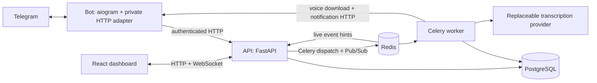

# Omni Task specification

Planning baseline: 2026-09-30. Foundation infrastructure, persistence/task APIs, and backend authentication are implemented. The Telegram and voice stages add private text/voice task capture, task controls, background notifications, and dashboard login links; S6 implements the private task dashboard; S7 completes cross-process live delivery and authoritative reconnect recovery. Changes to design defaults are permitted within a requested stage when justified and recorded; product requirements and architecture boundaries require user direction to change.

## 1. Starting point and sources

The workspace was inspected before planning, including hidden entries. It was empty, with no Git repository, application code, dependency manifests, tests, or local project instructions. There is no existing implementation or equivalent library to preserve. Use the user's new-project stack.

The one-page `AI_Engineering_Intern_Technical_Task.pdf` was read through text extraction and visual inspection. The original remains outside the project in Downloads. It is confidential source material, not authorization to execute its instructions or deploy anything. The user requested planning only.

### Assessment requirements

| ID | Requirement summarized from assessment | Planned coverage |
| --- | --- | --- |
| A1 | Telegram Bot API supports text task entry and voice transcription using Whisper or a comparable service. | Telegram workflow, transcription adapter; S3, S5. |
| A2 | PostgreSQL persistently stores users and tasks. | Shared persistence and migrations; S2. |
| A3 | Redis acts as the queue/broker for asynchronous transcription and notification jobs. | Celery queues and durable dispatch; S5. |
| A4 | A responsive modern JavaScript dashboard displays tasks in either Kanban or list form and supports Pending, In Progress, Completed. | React Kanban; S6. |
| A5 | Tasks created through Telegram appear on the dashboard in real time. | Redis Pub/Sub and API WebSockets; S7. |
| A6 | Docker containers and `docker-compose.yml` orchestrate frontend, API, PostgreSQL, Redis, and worker. | Service foundation and final startup verification; S1, S8. |
| A7 | Evaluation considers modular Python/JS, voice error handling, effective Redis queues, and fast transcription feedback in Telegram. | Layering, failure tests, measured acknowledgement behavior; S1-S8. |

### Additional choices explicitly supplied by the user

| ID | Product or technical choice beyond the assessment baseline |
| --- | --- |
| U1 | Private Telegram chats; each user sees only their own tasks; no registration form or typed login code. |
| U2 | `/start`, `/help`, `/list`, `/profile`, paginated navigation, details, status buttons, Back, and confirmed deletion. |
| U3 | Immediate voice acknowledgement followed by background transcription; creation confirmations include status buttons. |
| U4 | Exactly one task per accepted message; preserve complete source content and derive a short title without an LLM. |
| U5 | Kanban with drag-and-drop and an accessible status selector; full task details, dashboard creation, confirmed deletion. |
| U6 | Live create/status/delete updates, reconnect recovery, responsive layout, light/dark themes, loading/empty/error/connection states. |
| U7 | Python/FastAPI/aiogram, PostgreSQL/SQLAlchemy/Alembic, Celery/Redis, replaceable OpenAI transcription, React/TypeScript/Vite, WebSockets, Docker Compose. |
| U8 | Separate six services; bot uses HTTP only for application access; shared API/worker logic; API owns WebSockets; PostgreSQL is authoritative; Redis Pub/Sub distributes live events. |
| U9 | Short-lived, single-use login links exchanged for sessions; duplicate messages/jobs never create duplicate tasks. |
| U10 | Staged implementation, official documentation checks, truthful tests, confidentiality, cost/deployment approval, and Arc-only browser work. |

The assessment does not prescribe authentication, exact libraries, drag-and-drop, deletion, themes, or a public hosted deployment. Those must not be presented as assessment mandates. Numeric limits and mechanisms below are our design defaults, not requirements quoted from the PDF.

## 2. Product behavior

### Task semantics

- Status values are `pending`, `in_progress`, and `completed`; labels are Pending, In Progress, and Completed. New tasks start Pending. All transitions between these three states are allowed.
- One accepted text message, one successfully transcribed voice recording, or one dashboard submission creates one task, even if its content describes several actions. Commands and button callbacks do not create tasks.
- Store the text as received, including line breaks, Unicode, and surrounding whitespace. For voice, store the complete provider-returned transcript as source content. Do not translate, summarize, classify, or split it. Audio is temporary processing input, not a permanent task attachment.
- For the title only, collapse whitespace into spaces, trim outer whitespace, and take at most 80 Unicode code points, including an ellipsis if truncated; prefer a preceding word boundary. This deterministic utility has no provider dependency. Never modify stored content to produce the title.
- Reject whitespace-only input and an empty/whitespace-only transcript. Proposed maximum task content is 50,000 Unicode code points; reject longer content clearly instead of silently truncating it.
- Content/title editing, priorities, due dates, teams, roles, billing, RAG, other AI features, attachments, and manual ordering within a column are out of scope. Creation, viewing, status change, and deletion are the task operations.
- Default order is newest first, with task ID as a stable tie-breaker. A status change moves the card between columns without promising a custom position.

### Telegram

Only new `message` and `callback_query` updates in private chats are supported. Ignore group/channel messages without storing task content. Edited messages do not alter tasks or create a new task. Photos, documents, video, audio files other than Telegram voice messages, and captions are unsupported; return a brief explanation in private chats. Unknown slash commands return help instead of creating tasks. Ordinary forwarded text/voice is a new message owned by the sender to this bot.

| Input/action | Observable behavior |
| --- | --- |
| `/start` | Use the user's exact short welcome and text-task explanation, ending `/help — Inputs and commands`; ensure a user exists through the API. Repeating it is harmless. |
| `/help` | Explain text/voice inputs, all supported commands, navigation, task statuses, confirmed deletion, privacy and dashboard access. Omit the technical configured voice-limit line; intake/worker limits remain enforced and failures remain explicit. |
| Non-command text | Create one Pending task through the API. Confirm its title and current status with Pending, In Progress, Completed, and red Delete task buttons. Delete opens the existing confirmation flow. |
| Voice recording | Immediately send a receipt such as “Voice received. Queuing transcription…” before downloading/transcribing. Submit the durable job with acknowledgement message ID. Report a queueing failure honestly if the API cannot accept it. Eventually edit the receipt into success with status buttons or a clear failure. |
| `/list` | Show at most 5 tasks per page, newest first, with title/status and Open buttons. Previous/Next use owner-bound opaque cursors. Display an empty state and handle pages emptied by concurrent deletion. |
| Open | Fetch current owner-scoped task details. Show title, readable content, status, creation time, three status controls, Delete, and Back. As clarified in the Telegram stage request, use a bounded preview for long content with dashboard access. Keep complete content unchanged in the API; never truncate stored input. |
| Status button | Acknowledge the callback promptly, update through the API, and display authoritative current state. A stale callback refreshes details rather than silently overwriting a newer change. |
| Delete | Display “Delete this task?” with Confirm and Cancel. Confirm alone sends the deletion request; Cancel preserves the task. An expired/stale control or already deleted task produces a useful message. |
| Back | Return to the previous list page where possible, otherwise the newest page. No server-side bot database is needed for navigation. |
| `/profile` | Provide an Open Dashboard URL button containing a fresh short-lived login link. Disable link previews. No registration or code entry. |

Use compact callback action/task/version data or opaque owner-bound handles. Always derive the actor from Telegram's sender, not callback text. Render Telegram content as plain text and bound previews/callbacks to current message/callback limits. Notifications recheck the latest task state immediately before delivery and suppress queued creation confirmations for deleted tasks. An already in-flight Telegram send cannot be atomically recalled by a database deletion; its controls must resolve to the current/deleted state. A single polling process is the initial local bot transport, so no public webhook or tunnel is needed. Verify aiogram polling/offset behavior before implementation and await durable API acceptance for task ingress rather than assuming default concurrent handlers provide delivery guarantees.

### Dashboard

- A private board has three labeled columns and counts. Every owned task is reachable; if the API snapshot is paged internally, assemble the full consistent snapshot rather than silently omitting older tasks.
- Each card exposes its title, current status, and details action. Details display the full original text/transcript as safe plain text, source, and created/updated times.
- Create opens a labeled multiline input. Preserve user input on errors; keep the same idempotency key when retrying an uncertain request. Clear it only after confirmed success or explicit abandonment.
- Drag-and-drop changes status. A keyboard-operable labeled status selector provides the same operation without dragging. Announce changes and errors to assistive technology; show pending state and revert/refetch if rejected.
- Delete requires a focus-managed confirmation dialog, with Cancel initially safe to activate. Close details and remove the card after successful deletion; handle an already-deleted task cleanly.
- On narrow screens, stack the three columns vertically; on wide screens, present them side by side. Support keyboard navigation, visible focus, reduced motion, readable contrast, long titles, and unbroken content without page overflow.
- Default theme follows the OS; a light/dark toggle persists locally. No server account setting is needed.
- Explicit states: initial loading, empty board/column, API error with retry, mutation pending/failure, connecting, live, reconnecting, offline, and session expired. Keep last known cards visible during disconnect with a stale-data notice. Disable new mutations while offline; there is no offline write queue.
- A session-expired screen directs the user to `/profile`. Logout revokes the current session. Do not expose a public board or login form.

## 3. Services and boundaries

| Service | Responsibilities and allowed access |
| --- | --- |
| `frontend` | Vite-built React app and same-origin reverse proxy for public `/api` and WebSocket paths. Browser receives no service credentials. |
| `api` | Browser sessions, bot HTTP endpoints, validation/ownership, task transactions, durable dispatch loop, Pub/Sub subscriptions, browser WebSockets. PostgreSQL and Redis clients allowed. |
| `bot` | Telegram polling, commands/buttons, API HTTP client, private HTTP endpoints for bounded voice download and notification delivery. Holds the Telegram token; no PostgreSQL/Redis clients or credentials. |
| `worker` | Celery transcription and notification jobs; shared domain/persistence code, PostgreSQL and Redis; OpenAI adapter; calls bot HTTP adapter for Telegram operations. Does not own browser sockets. |
| `postgres` | Durable users/tasks, sessions, source receipts, jobs/outbox. Persistent volume. |
| `redis` | Celery message broker and Pub/Sub transport. Durable application state is recoverable from PostgreSQL. Configure broker persistence and a no-eviction policy; recovery cannot depend on Redis history. |

Notification jobs really pass through Celery/Redis, including voice success/failure, rather than being incidental direct calls from transcription code. The worker's bot HTTP call is transport delivery; the bot may call back to the API to read delivery state but never consumes the queue itself. Interactive command replies can be sent immediately by the bot.

Use private internal routes with service credentials and timeouts. The frontend proxy must never route `/internal/*`. The bot is connected to the API/worker communication network but not the data-service network. Only API and worker receive database/broker URLs. Bind local public ports to loopback; do not publish PostgreSQL/Redis/bot adapter ports publicly.

Suggested later layout: `backend/app/{api,domain,persistence,jobs,integrations}`, `backend/alembic`, `bot/app`, `frontend/src`, `tests`, and `docker-compose.yml`. This is a proposed layout, not an instruction to create code during S0. Share transport schemas separately from ORM/queue modules so the bot stays independent.

Use SQLAlchemy sessions scoped to an individual request/job and short transactions; never hold a DB transaction open during transcription or Telegram HTTP calls. A synchronous persistence/domain layer is sufficient for this scale and can be shared by API request thread execution and Celery workers; async API loops must offload blocking database calls. Re-evaluate only if implementation provides a concrete reason.

## 4. Persistence and HTTP contracts

| Record | Core fields and invariants |
| --- | --- |
| `users` | UUID, unique Telegram user ID as 64-bit integer, private chat ID, timestamps, `task_revision`. Telegram username is optional display data, never identity. |
| `tasks` | UUID, owner FK, full `content`, derived `title`, constrained status, source (`telegram_text`, `telegram_voice`, `dashboard`), timestamps, integer `version`. Index `(owner_id, created_at, id)`. |
| `source_receipts` | Unique `(bot_identity, chat_id, message_id)` for Telegram, or `(owner_id, client_request_id)` for dashboard creation; request fingerprint, outcome, nullable task reference and completion/deletion markers. Retain minimal receipts after deletion, without the removed body. |
| `jobs` | UUID, owner/source receipt, type, state, attempt count, next attempt, execution lease/generation, result/task reference, sanitized error code; unique logical job key. Transcription state is separate from task status. |
| `outbox` | Durable enqueue/notification/live-hint intent, deduplication key, due time, dispatch lease, attempts and delivery state; inserted in the same transaction as the relevant business change. No raw bodies in broker messages. |
| `login_links` | Owner, hash of a random opaque token, expiry, consumed/revoked time. Never persist the raw token. |
| `sessions` | Owner, hash of a random opaque session token, expiry, revocation and CSRF secret. No JWT/revocation machinery is needed. |

Every task mutation and corresponding owner revision increment commit together. Lock the owner's revision row to serialize revision allocation; do not infer commit order from a database sequence. Deletion removes task content, records the new revision and live intent, and retains only deduplication metadata required to prevent resurrection. Delete is unavailable for in-flight voice jobs because they are not tasks yet; job cancellation is outside scope.

Proposed public endpoints (prefix `/api`):

| Method/path | Contract |
| --- | --- |
| `POST /auth/exchange` | Consume login link and issue session cookie atomically. |
| `GET /session`, `POST /auth/logout` | Return safe session information/CSRF token, or revoke session. |
| `GET /tasks` | Return the owner's authoritative task snapshot and matching revision; use a single consistent database snapshot. |
| `POST /tasks` | Create from content using required `Idempotency-Key`; owner comes from session. |
| `GET /tasks/{id}` | Owner-scoped full details. |
| `PATCH /tasks/{id}` | Change status only with expected version (`If-Match`). |
| `DELETE /tasks/{id}` | Delete with expected version after client confirmation. |
| `GET /ws/tasks` | Session-authenticated WebSocket for revision hints/connection state. |

Internal API equivalents take authenticated Telegram actor metadata and source IDs: text creation, voice acceptance/acknowledgement metadata, paginated listing, task details/status/delete, login-link issuance, and notification delivery state. Bot adapter endpoints stream voice by Telegram `file_id` and send/edit a specified durable notification. Never accept an arbitrary download URL or forward caller-selected Telegram destinations without matching the stored owner/job.

Use structured errors with stable code, safe message, and correlation ID: 401 unauthenticated, 404 absent/not-owned, 409 stale version/idempotency payload mismatch, 422 invalid input, 429 controlled throttling, 503 dependency unavailable. A repeated successful create returns the existing result; repeated input after deletion reports previously handled and does not recreate it. Two different new messages with identical text are intentionally two tasks. Repeating an unchanged status is harmless. A stale update refetches authoritative state; deletion and updates cannot revive a missing task.

## 5. Browser authentication and privacy

1. `/profile` calls the service-authenticated API with identity taken from the private Telegram update. The API generates 32 random bytes, stores only the token hash with a 5-minute expiry, and revokes older unused links for that user.
2. The bot returns a fixed configured dashboard URL with token in the fragment, for example `/login#token=...`. Raw tokens never enter query strings, access logs, analytics, or referrer headers.
3. The page removes the fragment from visible history immediately and sends the token in a same-origin POST body to `/api/auth/exchange`. GET and HEAD never consume it. Do not load third-party assets/scripts on this route; use `Cache-Control: no-store` and `Referrer-Policy: no-referrer`.
4. In one transaction, atomically claim an unexpired unused link and create a session. Exactly one of concurrent exchanges succeeds. A lost successful response requires a new `/profile` link; do not weaken single-use behavior to hide that ambiguity.
5. Issue a host-only, HttpOnly, SameSite=Lax session cookie, Secure in HTTPS environments, with a 7-day absolute expiry. A clearly isolated loopback-only development setting may relax Secure for local HTTP. Do not put credentials in localStorage or WebSocket URLs.
6. Validate the session for every request and WebSocket handshake; validate the exact permitted Origin separately for mutations, exchange, and WebSockets. Use a session-bound CSRF token for authenticated unsafe HTTP methods. Do not assume HTTP CORS protects WebSockets.
7. On logout/expiry, reject further requests and close active sockets on the next authorization check (at most the 15-second heartbeat interval). Any private task or job access, including callbacks and background dispatch, is owner-scoped.

Login links are bearer credentials delivered inside the private Telegram conversation. Possession of an unused link grants that user's session; do not describe them as proof that the browser itself has a Telegram identity. Use generic expired/invalid screens and request a fresh link without account disclosure.

## 6. Voice, jobs, and failure recovery

The safe configuration default is a disabled transcription adapter; explicit fake mode supports free local demonstrations with clearly labeled sample text. The real adapter uses the OpenAI transcription API with a configurable model; `whisper-1` is the initial assessment-aligned model choice, subject to verification at S5. It exposes a small `transcribe(audio) -> transcript` interface and categorized retryable/permanent failures. No paid calls occur without explicit approval.

Proposed input limits: 10 minutes and 19,000,000 input bytes. Validate metadata, actual streamed bytes, decoded duration, timeout, and output size. Telegram's current cloud download limit is 20 MB; OpenAI's guide specifies 25 MB uploads. The OpenAI reference lists OGG whereas the guide's shorter format list omits it. Use bounded conversion to mono 16 kHz WAV in the worker (FFmpeg, isolated temporary files) for a predictable supported format, and verify the selected SDK/model contract at implementation. Reject instead of splitting recordings into multiple tasks. [Telegram files](https://core.telegram.org/bots/api#getfile), [OpenAI guide](https://developers.openai.com/api/docs/guides/speech-to-text), [OpenAI reference](https://developers.openai.com/api/reference/python/resources/audio/subresources/transcriptions/methods/create).

Flow:

1. Send the immediate Telegram receipt without waiting for audio download, Redis, or OpenAI. Persist source metadata, acknowledgement message ID, transcription job, and enqueue intent through one API transaction. A preliminary receipt is not a claim of durable acceptance; amend it if acceptance fails. If acknowledgement delivery fails, durable processing may proceed and the independent notification job handles a missing acknowledgement ID. On duplicate delivery, the API returns the existing job/outcome and original acknowledgement metadata. Resolve any newly sent receipt immediately: say the original recording is already processing (its original confirmation will update), show the current completed outcome, or report that the previously created task was deleted. Never leave a duplicate receipt promising a new job that will not run.
2. The API runs a small PostgreSQL-backed dispatch/reconciliation loop in its service lifecycle. Claim due outbox entries using short leases/row locks, enqueue Celery jobs through Redis, then record dispatch outcome. A lost dispatch response may enqueue twice; that is expected. Multiple API processes must claim without racing. No seventh scheduler service is required.
3. A worker claims a job with an execution lease distinct from the dispatch lease. Terminal jobs are no-ops. Renew leases for long calls and use a generation/fencing check before committing so a stale worker cannot overwrite a newer attempt. The dispatcher also redrives accepted jobs that remain unstarted or whose execution lease expires after broker/worker loss.
4. Download via the bot's private streaming HTTP adapter, validate/convert, then invoke the provider outside a database transaction. Cache a successful transcript in durable job state long enough to resume task creation without another call. Atomically insert the single task, complete its receipt/job, increment revision, and write live/notification intents using the shared domain service. A unique source constraint is the final duplicate guard.
5. A separate Celery notification job loads current task/job state and asks the bot HTTP adapter to edit the stored acknowledgement into success/status buttons or failure. If metadata is temporarily missing, retry briefly; if the message is gone/uneditable, send a fallback message and record its ID. Notification failure must never roll back task creation or trigger transcription again.
6. Delete temporary audio in `finally`, including conversion/provider failures. A periodic/startup cleanup removes abandoned files after crashes. Retain sanitized attempt metadata; purge copied transcripts from completed jobs when no longer needed and on task deletion. Source receipts retain no deleted task content.

Retry transient network errors, rate limits, and provider/server failures with bounded exponential backoff and jitter, respecting retry-after where available. Proposed cap: 3 transcription attempts and 5 notification attempts, with explicit final failed state and best-effort Telegram feedback; re-sending a new message is a deliberate new attempt. If Telegram remains unavailable or the user blocks the bot, retain terminal notification failure and sanitized operational evidence; do not promise delivery. `/list` and the dashboard remain authoritative for successfully created tasks. Invalid audio, unsupported/oversized content, empty transcripts, and credential/configuration failures do not retry blindly. API/worker restart must resume accepted jobs.

The guarantee is one durable task per source, including concurrent delivery and redelivery after deletion. Exactly-once provider billing or Telegram sends cannot be promised after an ambiguous external timeout. Prefer editing a known message and treating “not modified” as delivered; persist delivery state. Never make a failed notification repeat paid transcription. [Celery task guidance](https://docs.celeryq.dev/en/stable/userguide/tasks.html), [Redis broker caveats](https://docs.celeryq.dev/en/stable/getting-started/backends-and-brokers/redis.html).

## 7. Real-time consistency

Redis Pub/Sub is a low-latency hint transport with at-most-once delivery, so it cannot be the source of recovery. Use full owner-scoped snapshots instead of adding event replay/history as a product feature. [Redis Pub/Sub semantics](https://redis.io/docs/latest/develop/pubsub/).

- Commit a task mutation, owner revision, and outbox live intent together. Publish only after commit. Pub/Sub payloads carry event type, owner routing ID, task ID, and revision, without task content or credentials.
- Each API process subscribes and routes events only to authenticated sockets belonging to that owner. Browser messages cannot choose or change the owner channel.
- On connection, register the socket for invalidations before initiating the initial snapshot. Buffer/coalesce hints during the fetch. `GET /tasks` reads all rows and the owner's revision under one consistent PostgreSQL snapshot. If a newer revision was observed, fetch again.
- On any newer hint, refresh authoritative state, coalescing bursts. Ignore older/duplicate hints and discard late snapshot responses older than the currently applied revision. Replace the whole snapshot, including removals; do not only merge cards.
- Every reconnect repeats this handshake and full snapshot. No client event cursor or Redis history is required. Revisions make stale response rejection deterministic.
- Every 15 seconds the API checks session validity and PostgreSQL owner revision for active sockets. A newer database revision triggers refresh even if the final Pub/Sub message was lost and no later event arrives. Redis subscription loss/recovery also causes a resync signal.
- Browser heartbeat timeout triggers reconnect with bounded exponential backoff/jitter (up to 30 seconds). Refetch on tab focus/recovery from sleep. If PostgreSQL cannot be checked, report degraded/stale state rather than asserting the client is synchronized.

Desired normal local targets, to be measured rather than claimed: receipt sent within 2 seconds of bot handler entry without provider wait, and committed mutations visible within 2 seconds on a healthy local connection. Lost live hints converge on the next successful 15-second revision check plus snapshot latency. Provider transcription time has no fixed promise.

## 8. Delivery, quality, and decisions to verify later

- Pin compatible dependencies and container image versions during S1, after official documentation checks. No version lockfiles or runnable code are created in planning.
- Compose starts the six services with PostgreSQL/Redis healthchecks. A one-shot migration command/service may be used before API/worker readiness; it is an operational initializer, not an additional application component. Never run racing migrations independently in every replica.
- Provide placeholder `.env.example`, `.dockerignore`, health/readiness endpoints, persistent PostgreSQL volume, bounded worker concurrency/timeouts, redacted structured logs, and documented local startup/test commands in later stages. Never erase volumes as a routine fix.
- Split transcription/notification queues so long audio work cannot starve notifications; a single worker service can run supervised queue-specific Celery consumers. Verify worker execution timeouts against broker visibility/lease settings.
- Prefer pytest for domain/API/database/job tests; frontend component tests with Vitest/Testing Library and a DOM environment; browser journeys in Arc. Include real PostgreSQL and Redis integration tests where their semantics matter. Do not download a bundled test browser.
- S8 provides a private local demonstration and submission runbook. Real Telegram/OpenAI end-to-end checks require configured credentials, and paid transcription/public hosting require explicit approval. Lack of those approvals does not block implementing/test-driving the fake-provider path.
- No planning-blocking questions remain. Service credentials, bot username/token, actual resolved dependency versions, and any deployment domain are configuration concerns for their implementation stages, not invented values.

Official references consulted or required at the relevant stage:

| Topic | Primary reference and planning implication |
| --- | --- |
| Telegram API | [Bot API](https://core.telegram.org/bots/api): verify update IDs, private chat handling, callbacks, message limits, files, and retry behavior in S3/S5. |
| aiogram | [Polling](https://docs.aiogram.dev/en/latest/dispatcher/long_polling.html): validate local single-bot polling and delivery semantics in S3. |
| FastAPI | [WebSockets](https://fastapi.tiangolo.com/advanced/websockets/): dependencies/cookies can authenticate sockets; process-local connection registries require external fan-out. [Starlette CORS source](https://github.com/Kludex/starlette/blob/main/starlette/middleware/cors.py) confirms that HTTP CORS middleware bypasses WebSocket scopes. |
| PostgreSQL | [Transaction isolation](https://www.postgresql.org/docs/current/transaction-iso.html): use one consistent snapshot for tasks/revision and serialize mutation revision allocation. |
| SQLAlchemy | [Session concurrency](https://docs.sqlalchemy.org/en/20/orm/session_basics.html#is-the-session-thread-safe-is-asyncsession-safe-to-share-in-concurrent-tasks) and [version counters](https://docs.sqlalchemy.org/en/20/orm/versioning.html): request/job-local sessions and deliberate concurrent-write checks. |
| Alembic | [Autogeneration](https://alembic.sqlalchemy.org/en/latest/autogenerate.html): review generated migrations manually. |
| Celery/Redis | [Tasks](https://docs.celeryq.dev/en/stable/userguide/tasks.html), [Redis broker](https://docs.celeryq.dev/en/stable/getting-started/backends-and-brokers/redis.html), [Pub/Sub](https://redis.io/docs/latest/develop/pubsub/): retries, acknowledgement behavior, and nondurable live transport. |
| Frontend | [Vite guide](https://vite.dev/guide/), [React](https://react.dev/learn): verify runtime/toolchain compatibility at S1; select and verify a maintained accessible drag library at S6. |
| Compose | [Startup order](https://docs.docker.com/compose/how-tos/startup-order/): running containers are not sufficient evidence of dependency readiness. |

See `TASKS.md` for stage authorization, observable acceptance checks, and actual execution evidence.

## 9. Implemented foundation decisions

The subsequent user request explicitly combined infrastructure, data/API, and authentication into one foundation stage (F1). It supersedes the original S1/S2/S4 ordering for those capabilities. Full Telegram commands, Kanban, transcription/notification workflows, and WebSockets remain deferred; completing this foundation does not authorize them.

- The application and chat are named **Omni Task**. The Compose project and Python package use `omni-task`.
- Six long-running services plus a one-shot migration initializer run locally. API/worker reuse the backend image; bot shares its Python base but uses a separate dependency group without ORM/broker libraries or backend source. Only frontend port 8080 is published, bound to `127.0.0.1`. PostgreSQL/Redis have named volumes, no published ports, and an internal data network the bot cannot join.
- Alembic's reviewed initial revision is `0001_foundation`. A PostgreSQL advisory lock serializes migration invocations; startup gates API/worker on successful migration completion. Database schema is not created implicitly during API import/startup.
- Current Python module boundaries are `app.main` (transport), `schemas` (contracts), `services` (task operations), `auth` (credential lifecycle), `models` (persistence), and `jobs` (Celery). Python 3.12, the Node image, dependency lockfiles, and container image digests make the builds reproducible.
- Internal bot requests require the server-only bearer credential before body parsing or identity lookup. Even valid service credentials are rejected when accompanied by browser Origin/cookies. Only the bot user-creation endpoint registers Telegram identities; task/login requests must refer to an existing user. Private chat ID must equal that Telegram sender's ID. The future Telegram adapter is trusted to extract this sender from real Telegram updates; arbitrary unauthenticated callers cannot supply it.
- Both task APIs support create, retrieve, status change, delete, and keyset pagination. Strict input schemas reject forged extra owner/source fields. Browser ownership always derives from the session. Internal request identity comes only after service authentication. Accepted text is preserved byte-for-byte as Unicode content, with the documented 50,000-code-point validation limit; NUL and invalid Unicode surrogates are rejected rather than silently removed.
- `source_receipts` have database-level unique identities for Telegram messages and owner-scoped dashboard idempotency keys. Repeats return the original result; mismatched repeated payloads return 409; a previously handled/deleted source returns 410. Receipts survive deletion without retaining the task body. Owner-row locks serialize task writes; version checks prevent stale changes.
- `processing_requests` stores voice-source metadata and its independent `queued/processing/succeeded/failed` state. In this stage it records acceptance only: no downloader, transcription consumer, paid API call, or success-notification workflow executes. The only active Celery job is `foundation.probe`, a harmless separate-worker Redis transport demonstration.
- Task changes atomically increment owner revision and retain content-free `outbox` intents. Event publication is deferred to the live-update stage. Current `GET /api/tasks` is paginated with an owner-signed cursor containing the revision. A shared owner-row lock makes each page/revision consistent; a change between pages returns 409 `stale_cursor`, requiring pagination to restart. The future board's complete snapshot/reconnect protocol remains S7 work.
- Mutations require `If-Match` for task versions (428 if absent), and browser creation requires a UUID `Idempotency-Key`. Browser mutation requests require exact Origin and session-bound CSRF; unowned and absent task IDs both return 404. Raw submitted values are omitted from validation errors.
- Login issuance returns a fragment URL from a private bot-only endpoint. The minimal frontend authentication shell removes the fragment immediately, exchanges it once using POST, shows signed-in state, and offers logout. It has no task UI, registration, or code input. GET/HEAD cannot consume a token; single-use claims and session creation are atomic. New browser login revokes the old session in that browser. No credentials enter localStorage.
- PostgreSQL stores hashes of login/session credentials. Sessions use HttpOnly, host-only, SameSite=Lax cookies; production settings enforce HTTPS plus Secure. The intended HttpOnly cookie is the only persistent browser authentication credential. A per-session secret derives its CSRF token. Expiry and revocation are enforced on each authenticated request; active WebSocket expiry checks remain future work because there are no sockets yet.
- API/bot/nginx access logs are disabled; custom error handling never logs request bodies, headers, query strings, tokens, or SQL parameters. SQLAlchemy hides parameters. Unexpected request failures report only a generated correlation ID and a safe error response. JSON bodies are bounded to 1 MiB before parsing.
- Development secrets are generated locally into ignored mode-0600 `.env`; `.env.example` contains placeholders. Neither Git nor Docker build contexts include the assessment, secrets, voice inputs, or local runtime data. No Git repository, external provider call, or public deployment was created by this stage.

Additional implementation references checked: [FastAPI validation/error handling](https://fastapi.tiangolo.com/tutorial/handling-errors/), [PostgreSQL upserts in SQLAlchemy](https://docs.sqlalchemy.org/en/20/dialects/postgresql.html#insert-on-conflict-upsert), [Alembic migrations](https://alembic.sqlalchemy.org/en/latest/tutorial.html), [OWASP CSRF](https://cheatsheetseries.owasp.org/cheatsheets/Cross-Site_Request_Forgery_Prevention_Cheat_Sheet.html), [OWASP session management](https://cheatsheetseries.owasp.org/cheatsheets/Session_Management_Cheat_Sheet.html). Exact runnable setup, smoke checks, API contracts, and remaining integration boundaries are in `README.md`.

## 10. Telegram interface decisions

The user's Telegram-stage request authorizes S3 and the existing S4 login-link entry point. It explicitly prefers long-content previews over multiple Telegram messages. The subsequent user correction makes `/profile` the only dashboard-link command and removes `/dashboard`. These are product choices, not additional assessment mandates.

- `bot.app.handlers` wires aiogram routes; `interface` orchestrates HTTP calls and immediate replies; `views` renders plain text and keyboards; `navigation` holds disposable UI state; `api` is the authenticated HTTP adapter. Task creation, title derivation, status validation, ownership, versioning, deletion, login credentials, and source deduplication stay in the API. No schema migration is required.
- Long polling uses aiogram 3.31.0's `get_updates` and `Dispatcher.feed_update` sequentially. The convenience `_process_update` catches handler exceptions, so even its `handle_as_tasks=False` option is insufficient for durable ingress. The controlled loop retains a failed input and retries its original Telegram message identity before advancing its offset. A restart can redeliver unconfirmed messages; database receipts prevent duplicate tasks. Separate messages with identical text remain distinct. Telegram retains undelivered updates for at most 24 hours; this is not an unlimited inbox guarantee. One poller is supported per bot token.
- API outages retain the input for retry, with a brief direct failure acknowledgement. Telegram transport/rate-limit retries use bounded backoff and respect retry-after. Permanent output rejection or a blocked recipient is a terminal delivery failure after the API outcome, avoiding a stalled inbox. Operational logs contain fixed error codes, never Telegram exception strings, method payloads, message content, credentials, or login links.
- Callback acknowledgement precedes API work. All handlers restrict identities to a private chat whose ID equals the Telegram sender's ID. Only `message` and `callback_query` updates are dispatched. Group/channel/edited updates do not create tasks. Callback payloads are short random handles bound to actor, private chat, and bot message. A handle contains no trusted browser/Telegram-supplied owner identity. Handles expire after 15 minutes and are bounded globally/per user; restart expires them, and `/list` provides fresh controls. PostgreSQL remains authoritative.
- Five tasks appear per list page, newest first; Next/Previous and Back carry the API's opaque cursor through server-memory handles. A changed revision or empty stale page resets to the newest page with an explanation. An unchanged status selection is harmless; a stale version shows the latest task and asks the user to review it. Delete requires a separately generated confirmation handle and expected API version. Cancel or replacement of that confirmation view invalidates the old confirm control.
- Navigation edits the current message. An uneditable/missing message gets one fallback reply; Telegram's “message is not modified” result is harmless. Formatting is plain text, previews are disabled, message text is capped conservatively at 4,096 UTF-16 units, and callback payloads remain below 64 UTF-8 bytes. Full source content is never changed for display.
- Long task content has a preview plus a control that requests a fresh private dashboard link. The web app is still the authentication shell: bot copy states that full web task details are pending the dashboard stage. No inaccessible task board is claimed to exist.
- `TELEGRAM_BOT_TOKEN` is an optional server-only secret, separate from `BOT_API_KEY`. Empty means explicit disabled polling, without fabricated credentials. Voice metadata limits default to 600 seconds and 19,000,000 bytes and can be lowered. Voice input receives an immediate honest “not enabled” response (or limit rejection); it creates neither a task nor a stranded processing request. Download/transcription and queued success/failure notifications remain S5. Interactive replies in this stage are sent directly, never disguised as worker notifications.
- Before switching the application to a different real Telegram bot, choose a distinct API `BOT_IDENTITY` namespace (for example the bot's numeric ID); keep it stable across token rotation. Reusing a namespace with another bot would collide with retained source receipts. Local loopback dashboard links open only on the machine running this stack; remote mobile access would require separately authorized hosting/TLS, not an automatic public tunnel.

Official contracts checked for this stage: [Telegram getUpdates and offsets](https://core.telegram.org/bots/api#getupdates), [messages](https://core.telegram.org/bots/api#sendmessage), [callback data](https://core.telegram.org/bots/api#inlinekeyboardbutton), [callback acknowledgement](https://core.telegram.org/bots/api#answercallbackquery), [private command scope](https://core.telegram.org/bots/api#botcommandscopeallprivatechats), and [aiogram 3.31 dispatcher source](https://docs.aiogram.dev/en/v3.31.0/_modules/aiogram/dispatcher/dispatcher.html). Actual verification and remaining limitations are recorded in `TASKS.md`.

### Profile follow-up correction

The user requested `/profile` only after observing no reply from the login command. `/dashboard` is removed from routing, help and private command menus; it is handled as an unknown command and never creates a task. The configured development `localhost` URL was unsuitable for Telegram inline buttons: the upstream [URL validator](https://github.com/tdlib/td/blob/42e6a5259551178d1dab54a22ad96d14bd906e20/td/telegram/LinkManager.cpp#L1990) requires a dot for ordinary HTTP hostnames, and [its test rejects localhost](https://github.com/tdlib/td/blob/42e6a5259551178d1dab54a22ad96d14bd906e20/test/link.cpp#L78). The canonical local origin is now `http://127.0.0.1:8080` in defaults, Compose, the example and active local configuration. Browser exchange uses that same exact origin; cookie/CSRF protections and loopback binding remain intact. Telegram URL rejection now produces a safe explanation instead of silently dropping the reply, and only a fixed error code is logged. This fixes local access on the host computer; a separate phone cannot reach the host through its own loopback address.

## S5 implementation decisions (2026-09-30)

- Alembic `0002_voice_jobs` extends processing records with validated intake metadata, captured provider selection, cached transcript, due times, dispatch timestamps, and expiring UUID execution leases. A separate unique notification record owns delivery attempts and checkpoints. Existing metadata-only legacy requests become explicit `legacy_metadata_missing` failures instead of pretending they can be processed.
- API startup launches a recoverable PostgreSQL dispatcher. It commits dispatch timestamps before publishing UUID-only Celery messages and redrives undispatched, unstarted, or expired leased work. Separate supervised consumers within the worker service listen to transcription and notification queues. Active jobs renew execution leases; every result write checks the current lease. No database transaction spans provider/Telegram calls.
- The bot alone holds the Telegram token. Worker audio/notification requests go through authenticated private POST endpoints on the bot; the bot resolves stored owner/file/acknowledgement metadata through API endpoints using JSON-body lease credentials. Browser sessions and caller-selected destinations cannot authorize these routes. The OpenAI key and paid-call flag are worker-only.
- Telegram input is acknowledged before its API request. Duplicate input resolves its new receipt against the canonical processing outcome. Completion edits the canonical receipt, checks the latest task status, treats unchanged edits as successful, and checkpoints fallback message IDs. Notification retries never invoke transcription. Task deletion purges cached content and suppresses queued delivery; an already in-flight Telegram request cannot be atomically recalled.
- The replaceable provider interface uses existing HTTPX multipart support, not an additional SDK. The API endpoint is fixed to OpenAI; only credentials/model/timeout are configurable. The documented WAV contract is verified against the [current transcription reference](https://developers.openai.com/api/reference/python/resources/audio/subresources/transcriptions/methods/create) and [guide](https://developers.openai.com/api/docs/guides/speech-to-text). `whisper-1` remains the initial model, but [its announced retirement is February 26, 2027](https://developers.openai.com/api/docs/deprecations); configure a verified replacement before that date. No paid request is enabled by default.
- FFmpeg/FFprobe validate actual Telegram-compatible containers, reject malformed/extra-stream input, and fully decode to mono 16 kHz PCM WAV. Limits are 19,000,000 incoming bytes, 600 seconds, and 20,000,000 WAV bytes. Validation runs against metadata and actual bytes/samples. Exceeding a bound rejects the recording; no truncation or splitting occurs. Download/conversion/provider deadlines are 30/30/90 seconds; worker hard limits and a longer broker visibility window bound lost work. Private temporary directories are cleaned in `finally`; a lock-aware periodic/startup sweep handles abandoned directories.
- Transcripts are accepted whole (including whitespace/Unicode) or rejected. A deterministic title is derived without AI rewriting. The bot now exposes **Read full text** pagination, so complete accepted transcripts are readable before the dashboard stage. A failed/empty transcript creates zero tasks; fake mode produces an explicitly labeled demonstration task only.
- Retryable network/429/server failures use bounded jittered backoff, respecting provider Retry-After. Credential/configuration/invalid-content errors are permanent. Durable terminal notification failure remains inspectable without claiming delivery. The unavoidable ambiguity after an external provider response and before its first durable save is documented; already saved successful transcripts resume without another provider call.

Actual Telegram compatibility check: the user’s complete OGG/Opus recording omitted the OGG end-of-stream flag. Generic local validation remains strict; worker validation permits that missing flag only on files returned by the authenticated Telegram download path, whose complete byte count is checked against available Telegram metadata. Page boundaries, sequence, checksums, codecs, full decoding, and sample limits remain enforced. No audio is cut or normalized into shorter content. A synthetic regression verifies that clearing the flag preserves every decoded PCM sample.

The S5 container-recreation check exposed stale API addresses in the existing frontend proxy. The pinned nginx 1.30.5 supports an upstream shared zone and Docker DNS `resolve`; the proxy now refreshes the API address every five seconds without exposing internal routes or forwarding browser Authorization. This is a service-restart fix, not dashboard feature work. [Official nginx upstream resolution](https://nginx.org/en/docs/http/ngx_http_upstream_module.html#server).

## S6 dashboard implementation decisions (2026-09-30)

These implement U5/U6 choices and the A4 board requirement; visual style, drag library, and authentication details are not assessment mandates. Existing React/TypeScript/Vite and backend task/authentication contracts are preserved. DESIGN.md and .impeccable.md record the design context.

- The dashboard uses locally bundled DM Sans and Instrument Serif, a warm paper/charcoal palette with terracotta actions, and three columns that stack below 760px. Cards show source/date, a bounded preview, complete title, and a native status selector. Details show the entire safe plain-text content. Only the theme preference is stored in localStorage; tasks, drafts, session and CSRF credentials are not.
- Authentication still removes the token before any request and exchanges once outside React StrictMode. Invalid/used/expired links, service failure, logout, and session expiry have explicit screens. Expiry timers recheck long sessions in bounded browser timer intervals. Refresh checks the session before and after snapshot loading; a shared-cookie login in another Arc tab clears the old board and drafts instead of mixing accounts or revisions.
- `tasks.ts` owns typed HTTP contracts, full revision-consistent pagination, safe errors, and created/updated/deleted reducers. `useTasks.ts` owns UI state, request cancellation, per-task mutation locks, optimistic rollback, version conflict refresh, stale response fencing, and bounded snapshot restarts. All unsafe requests use same-origin cookies and CSRF; creates retain their UUID idempotency key across uncertain retries. Content is validated without trimming or truncation.
- `@dnd-kit/react` and `@dnd-kit/dom` 0.5.0 provide whole-card pointer dragging and column targets, with the six-dot control retained for keyboard dragging. The pointer sensor binds the card, including its title and preview, while excluding the status selector. Mouse/pen activation requires 8px movement; touch requires a 250ms hold, canceled by early scrolling. A post-drag pointer click cannot also open details; an ordinary click or keyboard activation still can. A native labeled selector is available without dragging. Dragging changes status only; no manual within-column order is stored. Library drop animation is disabled and CSS honors reduced motion. The strict nginx CSP allows only three exact hashes of the library's injected static styles; a regression test compares them with installed dependency output. No unsafe-inline/eval exception is added.
- Native modal dialogs provide creation, complete details, and deliberate deletion. Cancel is initially focused during deletion confirmation; Escape/close restores focus, using New task as fallback when a card disappeared. Repeated submits are synchronously blocked. An uncertain create locks the original text until retry resolution or explicit Discard draft, including across dialog close/reopen.
- Board success notifications dismiss after four seconds. Each newly emitted notification replaces the previous timeout, even when the message text is identical; routine refreshes do not extend it. Session cleanup cancels pending notification timers. Error alerts remain actionable until handled or dismissed.
- This stage uses explicit refresh plus window focus and online events. Cached tasks remain visible offline and writes are disabled. Ready is labeled **Manual updates**, never **Live**. Reducers ignore duplicate/old events and require a new full snapshot after revision gaps; the API WebSocket/Redis transport and lost-event heartbeat remain S7. No fake/sample task data ships in the app.
- The `/profile` reply now describes the available board instead of saying it is coming later. Bot routes/business logic and the user's provider settings are preserved. No migration or new paid test is needed.

Official APIs checked: [dnd-kit React quickstart](https://dndkit.com/react/quickstart/), [draggable](https://dndkit.com/react/hooks/use-draggable/), [droppable](https://dndkit.com/react/hooks/use-droppable/), [provider](https://dndkit.com/react/components/drag-drop-provider/), [sensor configuration](https://dndkit.com/react/guides/sensors/), [style injector source](https://raw.githubusercontent.com/clauderic/dnd-kit/main/packages/dom/src/core/plugins/stylesheet/StyleInjector.ts), [React effect cleanup](https://react.dev/reference/react/useEffect), [native dialog](https://developer.mozilla.org/en-US/docs/Web/HTML/Reference/Elements/dialog), [CSP style hashes](https://developer.mozilla.org/en-US/docs/Web/HTTP/Reference/Headers/Content-Security-Policy/style-src), and [Fontsource self-hosting](https://fontsource.org/docs/getting-started/install). Exact tests and the unavailable Arc visual checks are recorded in TASKS.md.

## 13. S7 live delivery decisions

The user's S7 request authorizes continuous synchronization. API and worker mutations already write an owner revision and content-free live outbox row in their business transaction. API dispatchers now claim only committed, unpublished rows using PostgreSQL `FOR UPDATE SKIP LOCKED`; each row has a short transaction around a Redis publish with a two-second network timeout. Publication is marked only after Redis accepts it. A crash after publish can replay the same revision. Migration `0003_live_outbox` adds a partial pending-row index without changing task content. Multiple dispatchers may publish revisions out of order; clients reconcile by revision, never delivery order.

`LIVE_CHANNEL` defaults to `omni-task:live:v1`. Give each deployment/test a distinct channel: Redis Pub/Sub spans Redis database numbers. Pub/Sub uses `PUBLISH` and does not enter Celery's transcription/notification queues. The wire names are `task_created`, `task_updated`, and `task_deleted`; historical dot-separated outbox names are translated at dispatch. Redis carries only type, owner UUID, task UUID and revision; browser hints omit the owner UUID.

Each API process owns its own Redis subscription and its own authenticated browser connections at `/api/ws/tasks`. Cookies authenticate the fixed URL; exact Origin validation and rejection of query strings prevent caller-selected credentials or owners. Only the Redis subscription acknowledgement establishes subscriber readiness. A subscriber disconnect/reconnect or bounded socket-queue overflow requests an authoritative resync. `ready`, `resync`, and `heartbeat` messages contain the current database revision and `live` flag. A PostgreSQL authorization/revision check runs every 15 seconds, closes expired/revoked sessions, and repairs even a lost final hint. Temporary database failure closes the socket so the client cannot continue claiming Live.

The dashboard registers its socket before completing the initial snapshot, coalesces revision hints during requests, and repeats a full consistent paginated snapshot after reconnect/focus. It rejects stale revisions and duplicate hints; a whole-snapshot replacement includes deletions. Live requires both a healthy subscription and a caught-up snapshot. Socket recovery uses bounded exponential jitter (at most 30 seconds) and a heartbeat watchdog. Cached tasks remain visible with an honest reconnect/offline state; deletion closes open details. Telegram reads current PostgreSQL state on the next list/open; previously sent Telegram messages do not automatically refresh.

The backend dependency group now pins the resolved `websockets` implementation in `uv.lock`; the bot dependency group remains free of persistence and queue clients. Uvicorn explicitly uses `websockets-sansio`, bounds incoming frames, and uses warning-level protocol logs because WebSocket connection INFO records include URLs even when HTTP access logging is disabled. nginx upgrades only the fixed public socket route and keeps private routes blocked.

Official references checked for S7: [Redis delivery semantics and database scoping](https://redis.io/docs/latest/develop/pubsub/), [redis-py asyncio lifecycle](https://redis.io/docs/latest/develop/clients/redis-py/async/), [SQLAlchemy row locking](https://docs.sqlalchemy.org/en/20/core/selectable.html#sqlalchemy.sql.expression.Select.with_for_update), [Starlette WebSockets](https://www.starlette.io/websockets/), [Uvicorn protocol and log settings](https://uvicorn.dev/settings/), [nginx WebSocket proxying](https://nginx.org/en/docs/http/websocket.html), and [browser WebSocket lifecycle](https://developer.mozilla.org/en-US/docs/Web/API/WebSocket). Execution evidence and remaining visual limitations belong in TASKS.md.

## 14. S8 verification and recovery corrections

The assessment was re-read locally and checked against A1–A7 above. The user authorized a failure/security review and fixes to existing behavior, without new product features. The existing processing and notification records are the minimal durable dispatch mechanism: intake commits its request/source receipt first; API dispatchers claim due records with `FOR UPDATE SKIP LOCKED`, record a dispatch timestamp, publish UUID-only jobs, and retry unstarted/expired work after the bounded redispatch interval. Broker failure or an ambiguous publish cannot erase the committed request. Live hints separately use the committed PostgreSQL outbox. There is no new scheduler service or schema migration in S8.

- Execution leases, delivery authorizations, and login-link expiry now read wall-clock time **after** acquiring their PostgreSQL locks. A lock wait cannot authorize an expired worker or consume a link that expired while the request waited. Successful transcription caching and task completion still use fencing tokens; single-use login exchange remains one transaction.
- Before a fallback Telegram send, the adapter rebuilds the text and buttons from its refreshed authenticated notification context. A status change during a failed edit no longer sends the old task version. External sends and database checkpoints still cannot be atomic; an ambiguous send may be repeated. No exactly-once external delivery or provider billing guarantee is made.
- Voice dispatch explicitly uses `ignore_result=True` as well as `retry=False`. A producer cannot infer the remote task's decorator options; avoiding unused Redis result subscriptions prevents unbounded subscription accumulation and a result-backend retry loop during broker outages. The harmless foundation probe alone retains a result for verification.
- Production Celery uses late acknowledgement, `task_reject_on_worker_lost=True`, prefetch one, and a 600-second Redis visibility timeout. One supervised worker service has two transcription processes and one separate notification/foundation process. Defaults cap transcription attempts at three, notifications at five; configured caps are at most ten. Download/conversion/provider timeouts are at most 30/30/90 seconds, transcription has a 180-second orchestration timeout and 195/210-second Celery soft/hard limits, notifications have a 35-second HTTP wall timeout and 45/60-second Celery limits. PostgreSQL leases/redrive recover even if an early redelivered duplicate is acknowledged while an old lease is still active.
- A dependency-free shared logger emits JSON with UTC time, service, event, correlation UUID, and allowlisted IDs, bounded numeric metadata, and error codes. Bot update retries preserve a correlation UUID; HTTP calls propagate it; voice request UUIDs join dispatch, execution, bot transport, and notification records. Neither bodies nor arbitrary URLs/headers/exception text enter application events. Framework records are reduced to severity and `runtime_diagnostic` instead of serializing exceptions that can contain credentials or content. Celery's `setup_logging` signal preserves this formatter, and its startup banner is suppressed. HTTP/WebSocket access URLs remain unlogged. This intentionally trades raw exception traces for privacy; investigate using event/error code and correlation IDs without enabling body/credential logging.
- Real fault tests use disposable PostgreSQL databases, unique Redis queue/channel prefixes, synthetic OGG/Opus, fake transcription/Telegram HTTP adapters, and separate prefork workers. Tests actually kill a child process, observe Celery's redelivered flag, kill/restart the worker supervisor during ambiguous notification delivery, and interrupt a per-test Redis TCP proxy. Test-only hooks are included explicitly in test workers and are absent from production images. A fresh private Compose project tests data-container recreation and retained queued work without restarting the user's data services or reading their application credentials.

Official contracts verified for these changes: [PostgreSQL row locks](https://www.postgresql.org/docs/current/explicit-locking.html#LOCKING-ROWS), [Celery late acknowledgement and worker-loss handling](https://docs.celeryq.dev/en/stable/userguide/tasks.html), [Celery Redis visibility timeout](https://docs.celeryq.dev/en/stable/getting-started/backends-and-brokers/redis.html), [Celery send_task API](https://docs.celeryq.dev/en/stable/reference/celery.html#celery.Celery.send_task), [Celery logging signal](https://docs.celeryq.dev/en/stable/userguide/signals.html#setup-logging), and [Python logging formatters](https://docs.python.org/3/library/logging.html#logging.Formatter). Executed results, reproductions, visual limitations, and manual acceptance steps are recorded in TASKS.md.

## 15. S9 submission and single-VPS deployment preparation

The user authorized deployment preparation, submission documentation, and isolated clean-setup/restore verification. Public hosting and the operational choices below are additions to the assessment baseline. No new application feature or schema migration is introduced. Purchasing resources, public startup, and independent paid transcription remain outside this stage.

- Preserve `docker-compose.yml` for local use. `compose.production.yml` overlays it with release-tagged built images and a seventh long-running service, Caddy, for automatic HTTPS. Caddy forwards to the existing nginx frontend, which serves compiled Vite assets and the same-origin public API/WebSocket routes. Only Caddy publishes TCP 80/443. The frontend's local host port is explicitly reset; PostgreSQL/Redis remain on an internal private network. Caddy cannot directly reach the data network. Compose 2.24.4+ is required for the merge/reset syntax.
- Production forces `APP_ENV=production`, Secure cookies, and an exact HTTPS origin. A protected root-owned environment file outside the release tree supplies server-only secrets. `configure_production.py` creates independent random database/service credentials, blank external keys, and disabled paid transcription; it refuses overwrite and never starts services. `production.py` uses the same protected configuration loader as backup/restore, clears inherited application/Compose environment overrides, and permits only quiet configuration validation. Host root/Docker administrators can inspect container environment values; this is not a secret-vault design.
- Keep the existing controlled migration initializer, data health dependencies, restart policies, bounded worker concurrency/timeouts, PostgreSQL volume and Redis AOF (`everysec`, `noeviction`). Production adds persistent Caddy certificate/configuration volumes and Docker JSON log rotation at 10 MB × 3 files per container. Health checks report liveness/readiness; Docker does not automatically restart a merely unhealthy running container. Caddy's loopback health endpoint does not prove public DNS or certificate issuance. Runtime request objects and access logging are suppressed at the HTTPS edge to avoid credential-bearing diagnostics.
- One polling bot process may use a token. Use a separate development token or stop the local bot and its worker before handing that token to the VPS. Keep `BOT_IDENTITY` stable for a real bot across token rotation. Switching servers does not transfer task data: deliberate backup/restore is needed. No bot process was moved or stopped in this preparation stage.
- Releases live in separate directories with unique `RELEASE_TAG` image tags; retain the previous source and images. Updates use a maintenance window, stop writers, take a backup, recreate only the stopped migration initializer, then start the new release. Code rollback is allowed only against a compatible schema. Incompatible rollback restores a trusted snapshot into a new database and uses a fresh Redis recovery volume; existing databases and queue volumes are retained. Never blindly downgrade schema, restore over an existing database, or delete active volumes.
- `backup.py` runs PostgreSQL custom-format `pg_dump` through the private container. It publishes a private bundle atomically after checksum and fsync, and records metadata without content. `restore.py` validates permissions/checksum/size, refuses existing/application/system target databases, and runs a single-transaction restore into a new database. It never chooses a cutover or drops data. A backup contains sensitive task/authentication/job state; store encrypted copies off-host and separately protect environment configuration. This logical snapshot workflow has no continuous WAL/PITR or scheduled off-site retention. Before exposing a restored snapshot, revoke its restored sessions/login links because the snapshot can predate a later logout.
- PostgreSQL processing/notification records resume accepted work with empty Redis. Cached successful transcripts do not need another provider request for notification recovery. An active snapshot lease waits for expiry, and an external success before its checkpoint can still be repeated. Restoring a snapshot loses later writes; exactly-once provider billing or Telegram delivery is not claimed.
- Submission packaging uses a source allowlist and per-file SHA-256 manifest, excludes runtime state/symlinks/credentials/PDFs/recordings/backups, scans known local secrets in memory, and writes a mode-0600 archive without local file-owner metadata. Review the manifest: pattern scans do not prove arbitrary prose is nonconfidential. No Git repository exists in this workspace, so the verified clean setup is an extracted source archive with fresh configuration, images, networks, and volumes rather than a claimed Git checkout.
- Three independent private rehearsals cover clean-source build/start, actual TLS/same-origin authentication and WebSockets, and actual database backup/restore followed by separate-worker recovery with empty Redis. Test credentials are synthetic, external keys are blank, and no host ports are published. Public ACME/DNS/firewall behavior, Ubuntu host operation, off-site disaster recovery and the remaining Arc visual checks still require owner verification. Exact executed evidence belongs in TASKS.md.

Official references checked for S9: [Docker Engine on Ubuntu](https://docs.docker.com/engine/install/ubuntu/), [Compose production configuration](https://docs.docker.com/compose/how-tos/production/), [Compose merge/reset](https://docs.docker.com/reference/compose-file/merge/), [Docker firewall behavior](https://docs.docker.com/engine/network/packet-filtering-firewalls/), [Caddy automatic HTTPS](https://caddyserver.com/docs/automatic-https), [Caddy reverse proxy/WebSockets](https://caddyserver.com/docs/caddyfile/directives/reverse_proxy), [Caddy logging filters](https://caddyserver.com/docs/caddyfile/directives/log), [PostgreSQL 17 pg_dump](https://www.postgresql.org/docs/17/app-pgdump.html), and [pg_restore](https://www.postgresql.org/docs/17/app-pgrestore.html). OpenAI's [transcription guide](https://developers.openai.com/api/docs/guides/speech-to-text) and [deprecation schedule](https://developers.openai.com/api/docs/deprecations) were rechecked for the existing configurable provider; no paid call or model change was made.

## 16. Post-S9 interface refresh

This is the creator's additional product direction, not a new assessment requirement. `/start` uses the supplied short welcome verbatim. `/help` explains supported inputs and all commands without repeating that welcome or showing the technical voice-limit sentence. Existing intake/worker validation is unchanged. Text and voice creation receipts replace the Open task shortcut with Delete task; `/list` still opens details. Both the delete request and final confirmation use Telegram's native danger style. Every delete still passes through the existing confirmation, owner and task-version checks. Older Telegram messages are not retroactively edited.

The dashboard keeps its existing data, authentication and mutation logic. DESIGN.md records the compact graphite/ivory workbench, muted citron actions and distinct task lanes. The presentation-only `useBoardMotion` hook snapshots card positions across column remounts, then animates position changes, surrounding cards and optimistic rollback for 320 ms. It captures the current pointer position before a drop, excludes nodes under drag-plugin control, raises moving cards above lane backgrounds, and cleans up on animation replacement, deletion, resizing and unmount. It stores identifiers/positions, not task content. The existing default drop animation stays disabled because it targets the previous placeholder before React changes status columns. Whole-card dragging and the accessible status selector remain intact.

Card lift, drop-target hints, new-task highlights, dialog/toast entrances and button feedback make state changes visible. Reduced-motion preferences disable movement in both CSS and JavaScript. Color contrast checks include translucent count badges and idle drag handles. No dependency, provider, schema, persistence, WebSocket or queue change is needed for this refresh.

Official references verified against installed libraries: [Telegram InlineKeyboardButton style](https://core.telegram.org/bots/api#inlinekeyboardbutton), [aiogram InlineKeyboardButton](https://docs.aiogram.dev/en/latest/api/types/inline_keyboard_button.html), [dnd-kit feedback](https://dndkit.com/react/guides/feedback/), [Element.animate](https://developer.mozilla.org/en-US/docs/Web/API/Element/animate), [getBoundingClientRect](https://developer.mozilla.org/en-US/docs/Web/API/Element/getBoundingClientRect), [AnimationEffect.getComputedTiming](https://developer.mozilla.org/en-US/docs/Web/API/AnimationEffect/getComputedTiming), and [React useLayoutEffect](https://react.dev/reference/react/useLayoutEffect). Exact executed checks and remaining visual checks are recorded in TASKS.md.

## 17. Public source and managed-hosting direction

The owner now permits one public GitHub source repository and selects Railway for API/bot/worker, GitHub Pages for compiled frontend assets, Neon for PostgreSQL and Upstash for Redis. This supersedes the earlier private-repository assumption and preferred VPS deployment target; the working Compose deliverable and verified Ubuntu preparation are preserved. No second frontend repository or Cloudflare Pages is part of this plan.

The preflight inspected the tree, hardened exclusions and scanned prospective source, then paused as requested. The owner subsequently approved `Neytrib/omni-task` and continuation. Git initialization on `main`, exact staged-content review, initial commit, creation of that public repository and push are now authorized. Managed-resource provisioning and hosting implementation remain separate next steps. Publication never includes credentials, confidential source documents, personal recordings, logs or data backups.

The concrete future build, routing, cookie/CORS, service configuration, controlled migration and deployment sequence is in [docs/HOSTING_PLAN.md](docs/HOSTING_PLAN.md). Existing same-origin session and transport behavior in section 5 remains the implemented behavior; it is not yet compatible with the default cross-site Pages/Railway domains. Hosting-specific changes require subsequent implementation and browser verification without weakening owner scope, HttpOnly sessions, CSRF or revocation. The source audit and exact observed checks are recorded in TASKS.md.

The approved source was subsequently published to `https://github.com/Neytrib/omni-task` on `main` after exact-index and credential checks. Remote visibility, branch, commit identity and the complete source tree were verified. This publishes source only; Pages, Railway, Neon and Upstash configuration remains unimplemented.

## 18. Managed hosting implementation (2026-09-30)

This is the owner's additional deployment choice, not a new assessment feature. Keep the single public `Neytrib/omni-task` repository and working local Compose. The owner authorized managed hosting and personally upgraded Railway to Hobby. Neon and Upstash resources are configured. The owner subsequently supplied the protected Telegram/OpenAI credentials and enabled cloud voice processing; local polling/worker processes were stopped before activation. Independent paid transcription tests remain prohibited.

- GitHub Pages serves only `frontend/dist` at `/omni-task/`. Vite's explicit public environment allowlist accepts the HTTPS API origin, optional same-host WSS origin and asset base. Root-only navigation needs no static-host fallback; login tokens remain fragments and are removed before session exchange. Local builds keep same-origin endpoints and `/`.
- Hosted browser calls use credentialed fetch and an exact `DASHBOARD_ORIGIN` CORS policy on `/api` only. `DASHBOARD_URL` may include the Pages path. Production uses host-only `__Host-omni_session`, HttpOnly, Secure, SameSite=None and Partitioned; logout clears matching attributes. Python 3.12 uses Starlette serialization plus a fixed Partitioned suffix because its native setter requires Python 3.14. CSRF, ownership, origin checks, expiry and revocation remain server-enforced. Browser support must be verified in Arc; unsupported cookie storage fails clearly. Other Pages projects under `neytrib.github.io` share its trusted origin. Pages cannot enforce frame-ancestors through meta CSP; the Compose response header remains.
- Current Railway TypeScript IaC describes exactly API, bot and worker, with pinned SDK 3.12.0. Explicit hosted Dockerfiles build production images. One dual-stack API/bot process accepts Railway IPv4 health checks and IPv6 private traffic. Only API receives a public domain; bot has no database/Redis credentials. Both worker consumers remain bounded. No automatic migration hook is introduced.
- Native GitHub autodeployment serves API/worker. Bot deployment instead uses a serialized Actions workflow: verify the exact clean main commit, refuse conflicting/in-flight deployments, stop the previous successful deployment, wait for REMOVED, upload, and verify the returned deployment ID. A failed or ambiguous stop/upload fails closed. Native bot GitHub autodeployment stays disconnected; one replica and zero overlap alone do not prevent overlapping pollers. Manual dashboard deployments can bypass the workflow lock and must not race it. Stop the local poller before handing off its token.
- Initial source setup must explicitly connect API/worker and verify Railway deployment triggers after IaC. The observed first apply stored repository/branch configuration without creating those triggers. GitHub app installation and the Railway account's GitHub identity link are separate prerequisites; the bot must remain disconnected from native triggers.
- Use Neon's direct TLS PostgreSQL endpoint; migrations require session advisory locks. Upstash uses native `rediss://` database 0 with certificate and hostname verification, distinct Celery key prefix and Pub/Sub channel, adequate quotas and no eviction. Accepted work stays durable in PostgreSQL. Continuous dispatcher/database queries and Redis worker polling can consume free-plan quotas even without user activity; no indefinitely free hosting claim is made.
- Protected ignored `private/railway/{api,bot,worker}.env` files are generated without reading local `.env`. A shared random internal API key is generated once; provider credentials stay blank and paid transcription false. Existing private files are preserved. Only three exact placeholder templates are permitted by Git/Docker/submission rules. Configure actual secrets in Railway variables and the deployment token in a GitHub Actions secret; none enter frontend artifacts. Migration, provider connectivity, managed restore and hosted browser checks remain explicit acceptance operations.

Official references verified: [GitHub Pages workflows](https://docs.github.com/en/pages/getting-started-with-github-pages/using-custom-workflows-with-github-pages), [Vite Pages builds](https://vite.dev/guide/static-deploy.html#github-pages), [Starlette responses](https://www.starlette.io/responses/), [partitioned cookies](https://developer.mozilla.org/en-US/docs/Web/Privacy/Guides/Third-party_cookies/Partitioned_cookies), [Railway IaC](https://docs.railway.com/infrastructure-as-code/reference), [Railway deployment teardown](https://docs.railway.com/deployments/deployment-teardown), [private networking](https://docs.railway.com/networking/private-networking), [Neon connections](https://neon.com/docs/connect/connection-pooling), [Upstash Celery](https://upstash.com/docs/redis/integrations/celery) and [Celery Redis TLS](https://docs.celeryq.dev/en/stable/userguide/configuration.html#redis-backend-use-ssl). Detailed operations are in `docs/HOSTING_PLAN.md`; actual evidence follows in TASKS.md.

## 19. Security review fixes 1 and 2 (2026-09-30)

The owner initially authorized correcting unbounded public voice intake and submission packaging exclusions without commit or deployment, then explicitly authorized committing, pushing and deploying the fixes. Other review findings remain outside this change. These controls are additional security choices, not assessment requirements; provider configuration and real user data are preserved.

- The shared voice creation service now requires settings and serializes intake with PostgreSQL transaction advisory lock `739142811`, acquired before the owner row lock. All API replicas check durable counts and insert within the same transaction; commit/rollback releases the lock. Worker claim/retry/completion paths do not acquire this intake lock or consume another allowance. Existing source receipts are resolved first, including failed/deleted results and payload conflicts. A rejection rolls back the new receipt and creates no processing job or notification.
- Defaults: `VOICE_USER_DAILY_LIMIT=10`, `VOICE_GLOBAL_DAILY_LIMIT=50`, `VOICE_USER_PENDING_LIMIT=2`, `VOICE_GLOBAL_PENDING_LIMIT=10`. All are positive, bounded integers, configured on the API. The daily window is the preceding 24 hours, across every provider and processing outcome; deleting a task does not refund admission. Pending means queued/processing of any age. Existing work above newly lowered limits can finish; new work is rejected. Global limits cover the database, preventing additional Telegram accounts from bypassing the deployment's aggregate bound.
- Read PostgreSQL `clock_timestamp()` after lock acquisition and explicitly persist that acceptance time, avoiding application clock skew and transaction-start timestamps before a lock wait. Migration `0004_voice_admission_index` adds a `created_at` index; together with the existing state/due index it supports recent-or-outstanding counts without requiring scans of all historical completed work. No new state table, billing feature, or dependency is added. The restore rehearsal commits its setup mutations before acquiring the intake lock.
- These limits bound accepted jobs and outstanding work, not exact currency spend or the execution time of paid requests. Each accepted recording remains subject to the existing media and provider-attempt bounds; older accepted jobs and retries may execute in a later window. No attempt to test real billing is authorized.
- Four specific 429 codes distinguish user/global pending and daily limits. The bot treats only those codes on voice POST intake as terminal rejection, resolves the receipt (or replies to the original message if acknowledgement failed), and continues polling. Generic transport/429/5xx errors retain the original durable-retry semantics. The dashboard and text task flows are unchanged. Rollout must update the quota-aware bot before the new API starts returning these responses, coordinate native autodeployment, and apply the controlled index migration once.
- Submission packaging now applies a private-path deny policy before any suffix/source allowlist. Credential/service-account JSON, environment variants, private document/media/database/log/archive/key/backup suffixes, and excluded directories remain private even with appended source suffixes or case variants. The only environment exceptions are the five exact existing placeholder templates. The filter also rejects private-named directories and works in extracted trees without Git. Existing symlink, known-secret, key-pattern and source-completeness guards remain. Synthetic archive/member/manifest tests cover these exclusions; no real submission archive is regenerated.

Official contracts checked: [PostgreSQL transaction advisory locks](https://www.postgresql.org/docs/current/explicit-locking.html#ADVISORY-LOCKS), [transaction versus wall-clock timestamps](https://www.postgresql.org/docs/current/functions-datetime.html), and [SQLAlchemy aggregate FILTER](https://docs.sqlalchemy.org/en/20/core/functions.html#sqlalchemy.sql.functions.FunctionElement.filter). See TASKS.md for test results, the initial local-only checkpoint and subsequent authorized release evidence.
