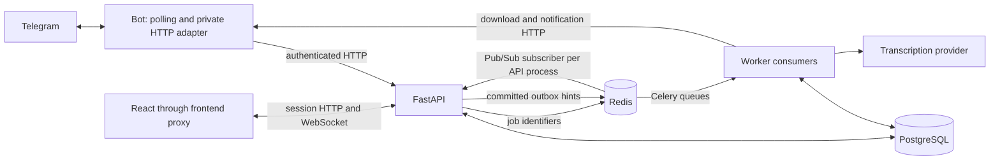

# Architecture walkthrough

Omni Task lets one Telegram user capture tasks by text or voice and manage the same tasks in a private browser board. A task is one complete message or transcript plus a short deterministic title. New tasks start Pending; transcription finishing does not mean the task itself is Completed. PostgreSQL holds the authoritative state. The bot and browser are two interfaces to it.

This is an explanation of the implemented application, not a list of future features. [SPEC.md](../SPEC.md) records decisions and official API references; [REQUIREMENTS.md](REQUIREMENTS.md) maps the assessment to code and actual test names.

## A short interview introduction

“The bot sends authenticated HTTP requests to FastAPI. The API commits tasks and durable delivery records in PostgreSQL. Celery workers receive identifiers through Redis, transcribe voice messages through a replaceable provider, and queue notifications separately. After a database commit, Redis Pub/Sub tells each API process that a user's board changed. The API sends that user's authenticated browser a small revision hint. The browser reloads authoritative task data, which also repairs missed events after reconnecting.”

## Why there are separate services

[Compose](../docker-compose.yml) runs frontend, API, bot, worker, PostgreSQL, and Redis. The frontend serves the built React app and proxies same-origin API/WebSocket traffic. The bot holds the Telegram token and handles Telegram transport. It has neither database/broker credentials nor access to the data-service network. The API validates requests, owns browser sessions and sockets, and performs task transactions. The worker shares backend business/persistence code, but never owns browser connections.

The worker container runs two separate Celery consumers: transcription and notifications/foundation. Long provider work therefore does not occupy the notification consumer. [The supervisor](../backend/app/jobs/worker.py) stops the container if a consumer dies, allowing the container restart policy to recover both. This is still one worker service with two consumer processes, not two additional Compose services.

A shared [Python image base](../Dockerfile) avoids unnecessary duplication; the bot installs its narrower dependency group. A one-shot migration service is a controlled startup step, not another long-running application. PostgreSQL and Redis use persistent volumes and have no published host ports in the local configuration. [README.md](../README.md) explains setup and deployment preparation.

## Follow one text message

1. The [poller](../bot/app/polling.py) receives a private-chat update. A [handler](../bot/app/handlers.py) passes complete text and the original Telegram source identity to the API. Handler code handles presentation and transport, not SQL or task rules.
2. The API authenticates the bot's server-only credential before resolving the Telegram identity. Browser sessions cannot use these internal bot routes. [Task services](../backend/app/services.py) derive the owner from that authenticated identity and enforce ownership for every read or mutation.
3. Within one PostgreSQL transaction, the service records the source receipt, creates the task, increments the owner's revision, and adds a live outbox entry. If the transaction fails, all four changes roll back together.
4. The API returns the authoritative task. The bot sends a confirmation with status controls. A repeated delivery of the same message resolves its existing receipt instead of creating another task. Two different messages with identical text remain two tasks.

Database uniqueness is the final duplicate guard; per-owner locking also coordinates concurrent requests. A minimal source receipt survives deletion so an old update cannot resurrect a deleted task. The receipt no longer retains the deleted task body. Browser creation has its own idempotency key, retained across uncertain retries.

The poller advances its offset only after the handler's durable outcome. This is deliberately sequential and easy to reason about, but an API outage can delay later updates. It is not an unlimited inbox: Telegram retains updates for a bounded period. A confirmation send can also be ambiguous even though the task was committed safely.

Titles collapse whitespace and choose a short boundary without an LLM. Complete accepted content remains unchanged, including Unicode and line breaks. Inputs over 50,000 Unicode code points, blank inputs, and invalid characters are rejected rather than truncated. Telegram details use a bounded preview with dashboard access for long content; browser details expose the complete stored value as safe text.

## Follow one voice recording

The bot acknowledges receipt **before** API submission, audio download, conversion, or transcription. It sends the file identifier, original message identity, and acknowledgement reference to the API. The API commits a processing request and dispatch intent. Processing states such as queued/processing/succeeded/failed are separate from the task's Pending/In Progress/Completed status.

The [dispatch loop](../backend/app/jobs/dispatcher.py) publishes a UUID to the transcription queue. The audio and transcript are not embedded in queue messages. PostgreSQL retains the intent, so a Redis outage or an uncertain publication can be retried. The [job](../backend/app/jobs/voice_tasks.py) claims a renewable, fenced lease through the [voice domain](../backend/app/voice.py). Concurrent or stale workers cannot both commit a task for the same source. Time is checked after database lock waits, so a lease cannot remain valid merely because it was valid before waiting.

The worker downloads through the bot's authenticated HTTP adapter; only the bot needs the Telegram token. Intake metadata and actual downloaded bytes/duration are checked. [Media processing](../backend/app/voice_media.py) validates and converts supported Telegram audio to a bounded WAV input using FFmpeg. Download, conversion, and provider work have explicit timeouts. Temporary files are cleaned after success/failure, with a stale-file sweep for interrupted jobs.

The small [provider interface](../backend/app/voice_provider.py) has disabled, explicit fake, and OpenAI implementations. The OpenAI model/key are configurable and paid calls have an explicit gate. Fake mode returns clearly disclosed sample text; it is never an automatic fallback for failed recognition. A failed or empty transcription creates no task.

A successful complete transcript is checkpointed before task creation is retried. The final transaction creates one Pending task and an independent notification intent. A notification retry therefore does not call the transcription provider again. The notification consumer updates the original acknowledgement with task status buttons; unchanged-message edits count as success. If editing is impossible, fallback sending is checkpointed and current task state is rechecked first. Deleted tasks suppress pending content delivery.

Transient failures use bounded retry/backoff; permanent failures produce clear operational failure messages. A process can still die after an external request succeeded and before its result was durably checkpointed. Neither OpenAI requests nor Telegram sends participate in the database transaction. We guarantee source-level task uniqueness, not exactly-once external billing or notification delivery. [Recovery tests](../tests/test_delivery_recovery_integration.py) exercise real Redis and killed/restarted worker processes with fake external transports.

## How private dashboard login works

`/profile` asks the API for a fresh short-lived, single-use login link. The random token is stored as a hash; its URL uses a fragment, which ordinary HTTP requests do not send to the server. The [browser login code](../frontend/src/auth.ts) removes it from the visible URL, then exchanges it through a POST. A simple GET or link preview does not consume it.

[Authentication](../backend/app/auth.py) locks the link row and rechecks expiry/revocation with a fresh clock after the lock is acquired. Only one concurrent exchange can succeed. The result is an opaque, expiring server session, also stored as a hash. The browser receives a host-only HttpOnly SameSite cookie; production requires Secure HTTPS cookies. Unsafe requests additionally require the exact configured Origin and the session-bound CSRF header. Logout revokes the server record rather than merely deleting a browser value.

The browser never chooses its owner ID. Task queries, pagination cursors, callbacks, and WebSocket connections remain owner-scoped. Only theme preference is persisted in localStorage. Tabs in one browser profile share a session cookie, so a changed session is checked around snapshot loading before private board state is replaced. WebSockets recheck session expiry/revocation periodically; logging out clears local state immediately and closes other connections within the session-check interval.

## Why live messages are hints rather than task copies

[Task mutations](../backend/app/services.py) write the task, owner revision, and outbox together. The [outbox publisher](../backend/app/live_outbox.py) reads committed rows and publishes content-free hints to a dedicated Redis Pub/Sub channel, separate from Celery queues. A crash after publication but before marking the outbox row can repeat a hint; a disconnected subscriber can miss one. Both outcomes are expected.

Every API process has its own [Redis subscriber](../backend/app/realtime.py) and its own local browser connections. It forwards each hint only to the owning user's sockets. Containers do not need shared memory. Socket authentication uses the HttpOnly cookie and an exact allowed Origin; credentials are not put in the WebSocket URL. Browser messages contain a type, task ID, and revision rather than full task content.

The [frontend](../frontend/src/useTasks.ts) subscribes before its initial snapshot, tracks the greatest requested revision, and coalesces hints while loading. It fetches all pages of an authoritative owner snapshot; if a paginated read becomes inconsistent, it restarts. It never replaces the board with a partial snapshot. Older snapshots or repeated/out-of-order hints cannot overwrite newer state. Status writes use optimistic UI plus version checks; rejection restores/refetches authoritative state. A remote deletion removes the card and closes its open details safely.

The browser reconnects with bounded jittered backoff and reloads after reconnect, online, and focus events. The API sends regular heartbeats with PostgreSQL's current revision, so even a lost final deletion hint is repaired without waiting for another task change. Subscriber disconnect/recovery also produces resynchronization signals. A browser watchdog detects stalled connections. The indicator says Live only when subscription and snapshot are caught up; offline mode keeps cached cards visible and disables writes.

This favors a simple, verifiable private board over the lower bandwidth of applying incremental task payloads. Full snapshots cost more as a user's board grows. There is no offline mutation queue or permanent event-history API. Redis Pub/Sub is a wake-up channel, not the source of truth. Dashboard changes appear the next time a task is opened/listed in Telegram; existing Telegram messages are not automatically refreshed.

## Observability and deliberate tradeoffs

[Structured logging](../omni_logging.py) records service/event names, correlation UUIDs, and allowlisted operational metadata. A bot update carries the same correlation across retries and HTTP calls; voice jobs use their durable request identity. Message bodies, transcripts, audio, credentials, login links, cookies, and raw provider exception text are excluded. Suppressing raw framework errors reduces accidental disclosure but means debugging relies on fixed failure codes and deterministic reproduction.

This application is prepared for a single-host Compose deployment. Multiple API processes are tested, but that is not a claim of an operated multi-host high-availability system. Persistent volumes and durable dispatch improve recovery; they do not replace verified off-host backups. The task list has no teams, roles, priorities, due dates, content rewriting, or extra AI behavior. Those omissions preserve the requested scope.

## What was actually checked, and who did the work

S8 on 2026-09-30 recorded 356 passing backend tests using real PostgreSQL/Redis where relevant, 125 passing frontend DOM tests, type checking, a production build, and Ruff checks. Two-user boundaries, concurrent duplicate delivery, lost/repeated events, database lock waits, worker loss, and Redis outages have executable checks. Some Arc desktop checks were performed; phone, light-theme, 200% zoom, and actual whole-card pointer drag still need visual verification. The [requirements map](REQUIREMENTS.md) names the tests and qualifies historical/manual evidence. S9 documentation does not establish a new test run or public deployment.

Codex contributed substantially to design, implementation, debugging, tests, review, and documentation under the user's staged direction. The user supplied requirements, credentials, feedback, and the reported real voice test. A fair interview explanation acknowledges this collaboration and demonstrates understanding of the actual code and its limits; it does not claim unaided authorship or personally executed checks that were performed by the assistant.
